# 📘 Git & GitHub Beginner's Guide

This is a simple step-by-step guide for learning **Git** and **GitHub**.  
It explains the most common commands with beginner-friendly explanations and examples.  

---

## 1. 🔧 Initial Setup

### Initialize a New Repository
Start tracking your project with Git:
```bash
git init
```
👉 Creates a hidden `.git` folder that stores all version control data.

### Configure Your Identity
Before making commits, tell Git who you are:
```bash
git config --global user.name "Your Name"
git config --global user.email "your.email@example.com"
```

### Set Default Branch Name (Optional)
GitHub uses **main** as the default branch. You can set this globally:
```bash
git config --global init.defaultBranch main
```
Check your current default:
```bash
git config --global init.defaultBranch
```

### Ensure UTF-8 Encoding (For International Users)
```bash
git config --global core.quotepath false
git config --global i18n.commitencoding utf-8
git config --global i18n.logoutputencoding utf-8
```
In Git Bash, also run:
```bash
export LANG=zh_CN.UTF-8
```
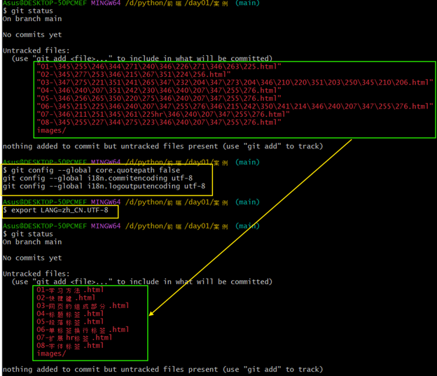
---

## 2. 🛠️ Basic Git Workflow

Git has **three main stages**:

1. **Working Directory 📝** → Where you edit files.  
2. **Staging Area 📦** → A “waiting room” for changes you want to commit.  
3. **Repository 📚** → The permanent history (commits).  

---

### Step 1: Add Files to Staging
 staging area is where you prepare files for a commit.
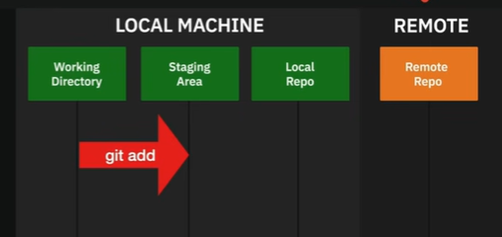

Add a single file:
```bash
git add filename.html
```
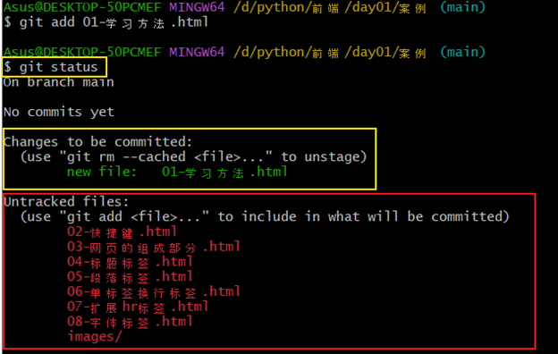
•	Add all changes (use carefully – it adds everything!):
```bash
git add --all
git add -A
git add .
```
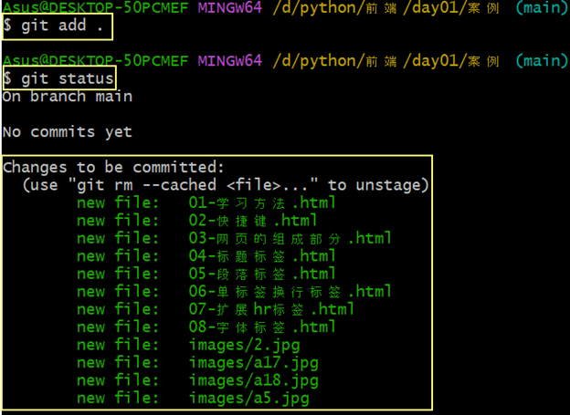
Stop tracking a file:

If you previously added a file but no longer want Git to track it:

```bash
git rm --cached filename.html
```
👉 File stays in your folder, but Git ignores it.

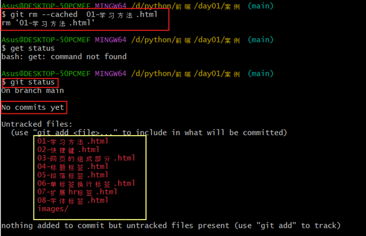
---

### Step 2: Commit Your Files

A commit is like saving a snapshot of your project at a specific point in time.
•	Each commit has a message that explains what changed.
•	Committing often with clear messages makes it easy to track progress and undo mistakes.
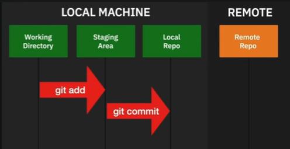


**Make a commit:**

First, make sure you’ve staged your files (with git add).
Then commit with a message:


```bash
git commit -m "Describe what changed"
```
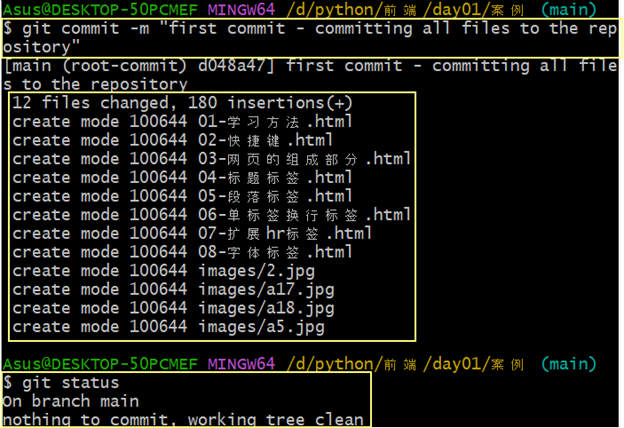

__Go back to a previous commit:__

Every commit has an ID (a long string like d3cc068).
You can “reset” your project to a previous commit if needed:

```bash
git reset <commit-id>
```
⚠️ Careful: This can change your project history. Beginners should use it cautiously.

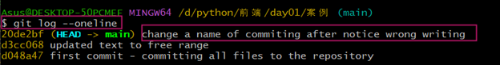

__Edit commit history (advanced):__

Git also lets you modify commit history:
- Reorder commits
- Merge commits together (squash)
- Edit commit messages

This is done with interactive rebase:


```bash
git rebase -i --root
```

Skip staging (only for tracked files):
```bash
git commit -a -m "Updated text"
```
👉 When you run this, an editor opens where you can adjust how commits appear in history.
(This is an advanced feature — useful later, but not necessary for beginners.)

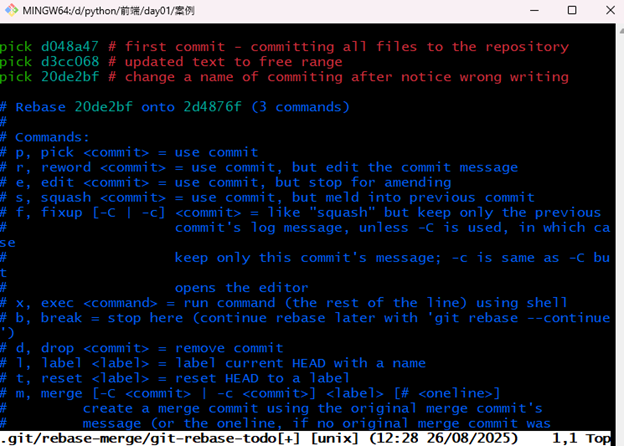
---

### Step 3: Check Status and Changes
Git helps you see what’s happening in your project.To see which files are modified, staged, or untracked
```bash
git status
```
- **Red** = modified but not staged  
- **Green** = staged and ready to commit  
- **Untracked files** = new files not yet added

See changes in detail:

To view the exact differences in your files (before committing):

```bash
git diff
```
- **Red (-)** = Lines removed are shown in red 
- **Green (+)** =  Lines added are shown in green 

🔄 Example Workflow
1.	You edit index.html.
2.	Run:
   ```bash
       git status
   ```
👉 Git tells you index.html was modified.

3.	Run

   ```bash
       git diff
   ```

👉 Git shows the before/after changes:

      - The original text (removed) is in red
      - The new text (added) is in green
      - This helps you review your edits before committing.

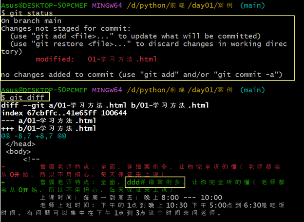
---

## 3. 📂 Managing Files

Git also helps you manage files — moving, renaming, or deleting them — while keeping track of changes.

### Unstage a File

🔄 What git restore --staged Does
When you run:
```bash
git add index.html
```
👉 You’re telling Git:
“I want to include index.html in my next commit.”
This moves the file into the staging area.
________________________________________
📌 But what if you added it by mistake?
Example situation:
1.	You edit index.html (added some new text).
2.	You type:
3.	``git add index.html``
✅ Now the changes are in the staging area.
4.	But then you realize:
“Oops! I’m not ready to commit index.html yet — maybe I need to fix it more first.”
________________________________________
🛠️ Solution: Unstage the file
Run:
```bash
git restore --staged index.html
```
👉 This removes the file from the staging area, but keeps your edits in the working directory.
- Your changes in the file are NOT deleted
- Git just won’t include them in the next commit (until you git add again)

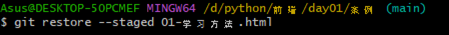

👉 Removes file from staging but **keeps your edits**.

### Rename a File

Use Git to rename a file so it tracks the change correctly:

```bash
git mv old.html new.html
```
👉 Don’t forget to commit after renaming.

💡 Example:
   
This before you rename your filename.

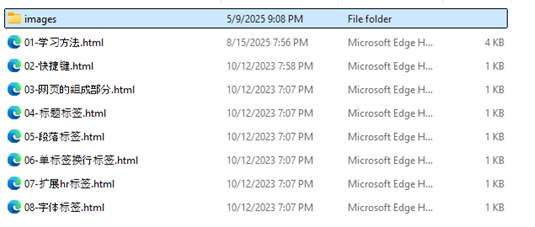
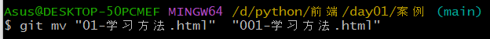
This is After a new filename
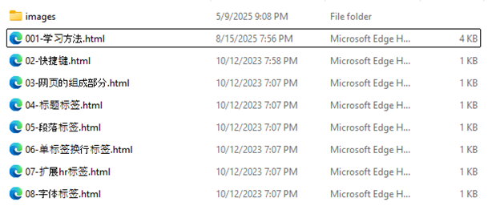
### Delete a File
Tracked file (already in Git):
```bash
git rm filename.html
```
Untracked file (never added to Git):  
👉 Just delete it manually in your file explorer.

---

## 4. 📜 Viewing History

Full log:
```bash
git log
```

One-line summary:
```bash
git log --oneline
```

Show changes in each commit:
```bash
git log -p
```

Fix last commit message:
```bash
git commit --amend -m "Corrected message"
```
⚠️ Use carefully — avoid on commits already pushed to GitHub.

---

## 5. 🌿 Working with Branches & Merge

### Branch Basics
Create a branch:
```bash
git branch new-feature
```

Switch to a branch:
```bash
git switch new-feature
```

Create and switch at once:
```bash
git switch -c new-feature
```

See all branches:
```bash
git branch
```
👉 The active branch has `*`.

---

### Merge Workflow Example
1. Create and switch to branch:
   ```bash
   git switch -c testbranch
   ```
2. Make changes, then commit:
   ```bash
   git commit -a -m "Changed file"
   ```
3. Switch back to `main`:
   ```bash
   git switch main
   ```
4. Merge branch into `main`:
   ```bash
   git merge -m "Merging testbranch" testbranch
   ```
5. Delete branch after merge:
   ```bash
   git branch -d testbranch
   ```

---

### Handle Merge Conflicts
If both branches change the same lines, Git will show conflict markers:

```diff
<<<<<<< HEAD
This is main branch text
=======
This is feature branch text
>>>>>>> feature
```

Resolve by editing the file manually, then:
```bash
git add filename.html
git commit -m "Resolved merge conflict"
```

---

## 6. ☁️ Connecting to GitHub (Remote Repository)

### Link Local Project to GitHub
1. Create a new repo on GitHub (do **not** add README).  
2. Copy repo URL (example: `https://github.com/user/repo.git`).  
3. Add remote:
   ```bash
   git remote add origin https://github.com/user/repo.git
   ```
4. Rename branch and push:
   ```bash
   git branch -M main
   git push -u origin main
   ```

---

### Push All Branches
```bash
git push --all origin
```

### Pull Changes from GitHub
```bash
git pull origin main
```

### Clone an Existing Repo
```bash
git clone https://github.com/username/repository.git
```

---

## 7. 🌐 Working on GitHub.com

### Add Files
- Click **Add file → Upload files**  
- Drag-and-drop files  
- Write commit message → Commit  

### Edit Files
- Open a file → Click ✏️ → Edit → Commit  

### Pull Requests
- Push branch → Click **Compare & pull request**  
- Write description → **Propose changes** → **Create pull request**  

### Issues
- Report bugs, request features, or discuss ideas.  
- Example: *“Add dark mode support.”*

### Settings
- Edit description, website link, and add tags for your repo.

---

## 8. ⚙️ Extra Tips

### Check Repo Root
```bash
git rev-parse --show-toplevel
```

### Using Vim in Git Bash
Quit without saving:
```
Esc → :q! → Enter
```
Save and quit:
```
Esc → :wq → Enter
```

---

✅ You now have a complete **Git & GitHub Beginner’s Guide** in Markdown.
