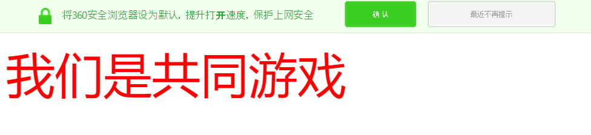

# 快捷键
**html:5 或者 shift + !**

>when you type *html:5 或者 shift + !* in html then enter
  
        <!DOCTYPE html>
            <html lang="en">
            <head>
                <meta charset="UTF-8">
                <meta name="viewport" content="width=device-width, initial-scale=1.0">
                <title>Document</title>
            </head>
            <body>
                
            </body>
        </html>
- 预览页面 atl + b
- 撤销 ctrl + z
- 反撤销 ctrl + y
- 粘贴 ctrl + v
  
# 网页的组件部分

- html 的注释 快捷键   ctrl + /

    >网页由三部分组成
      > 1. 网页的结构HTML(H5)------结构是非常的重要，是网页    
      > 2. 网页的样式css-----美化网页的，控制外观的
      > 3. 网页的行为JavaScript(JS) ------负责网页的动画的，特效，动画--行为

# 标题标签

  * 标签有 6个 h1-h6 
  
        <h1>kflngrvnvfjjlddddddddddddd</h1>         <h2>kflngrvnvfjjlddddddddddddd</h2>          <h3>kflngrvnvfjjlddddddddddddd</h3>           <h4>kflngrvnvfjjlddddddddddddd</h4>            <h5>kflngrvnvfjjlddddddddddddd</h5>         <h6>kflngrvnvfjjlddddddddddddd<h6>   
            
    
 * alt + shift + 光标键 下
 * alt + z 换行
  
# 段落标签

* 设置对齐方式： align 水平对齐---左对齐 left, 居中对齐 center ,右对齐 right
* 默认的是靠左对齐的
  
  > align 
  > 1. center
  > 2. left
  > 3. right 
  
      
文字左对齐

      
文字左对齐

      
文字左对齐

    运行
    
  
# 单标签换行签
  
*  双标签都是包含在一对<>尖括号里面的，有开始就有结果，开始和结束的区别就是结束多了一个反斜杠
  
        
段落标签就是双标签

        
段落标签就是双标签

    运行
    
     *他们两里面还有空行*

  注意： 我们的单标签就几个，大多数都是双标签，*br* 

    换行标签 
    换行标签
    换行标签 
    换行标签 
运行

# 扩展hr标签

  * 水平分割线，横线标签，默认的是通栏的(通栏是你缩小screen的时候就跟着你变形），默认的是居中的 
  * 线的宽度 width， 线的颜色 color, 线的大小 size

         

    运行

# 字体标签

  * ​​​字体标签 font 双标签 color 文字的颜色，size是文字的大小，了解即可 
  
  >​​​​重点： 
  > * 最大的字号只能到7，后面css就可以完美解决这个局限，完美解决这个问题 

    我们是共同游戏
    

运行

