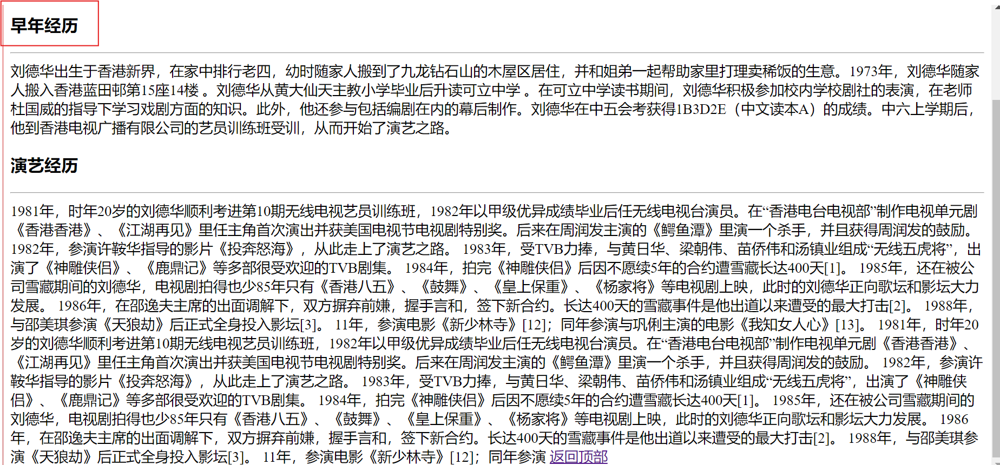
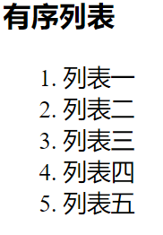

# 链接标签

> 我们的链接分为：网址链接，本地链接，空链接
* 链接标签 a 标签，下面演示网址链接
  
        a href="https://www.baidu.com/" >baidu</a>
        <a href="https://www.google.com/">google</a>
        <a href="https://www.youtube.com/">youtube</a>
* 空链接 #     
        
        <a href="#">空链接</a>

    * 扩展一个工作经验：加薪 我们有些写空链接就一个 #， 注意在工作里面也有写三个 ### 
    * 空链接就是为了占位，给3个###号为了解决空链接返回顶部问题的 
    
             <a href="###"> 空链接 ### 可以加薪 规范</a>
* 本地链接

      <a href="01.作业.html">本地链接</a>    

# 弹出新窗口  
* target="_blank" 弹出新窗口
    
        <a href="https://www.baidu.com/" target="_blank">baidu</a>
    运行
    

        <a href="https://www.google.com/   ">google</a>
        <a href="https://www.youtube.com/  ">youtube</a>
    运行
    
# 扩展大招
* 我们要加薪的时候到了上大招，优化代码 注意 /head 上面 的base  标签
* 扩展大招的意思是 不用再用target一个一个来用代码较多麻烦，就只用base 所有就弹出新窗口
    
        <!DOCTYPE html>
        <html lang="en">
        <head>
            <meta charset="UTF-8">
            <meta name="viewport" content="width=device-width, initial-scale=1.0">
            <title>Document</title>
            <base target="_blank"/>
        </head>
        <body>
            
            <a href="https://www.baidu.com/" >baidu</a>
            <a href="https://www.google.com/">google</a>
            <a href="https://www.youtube.com/">youtube</a>
        </body>
        </html>
    运行
    > 运行的时候所有的链接都这样
    
* 总结：目前为止：单标签 br , hr , base
# 综合案例

        <!DOCTYPE html>
    <html lang="en">
    <head>
        <meta charset="UTF-8">
        <meta name="viewport"   content="width=device-width,  initial-scale=1.0">
        <title>Document</title>
    </head>
    <body>
        <h1>睡眠问题：一般晚上几点睡觉比较健康</h1>
        
99健康网 的报道 • 3 个月 • 2 分钟读取

        

        
如果想要一个健康的生活方式，在睡觉时间上的规律程度就非常重要。那么晚上几点睡有益健康呢？中医理论认为：
        “肝之余气，汇于胆，聚而成精。胆为中正之官，五脏六腑取决于胆。气以壮胆，邪不能侵。胆气虚则怯，气短谋虑而
        不能决断。”由此可见胆的重要性。

    </body>
    </html>

* 空格代码： &nbsp； 一个空格大约占半个字左右，两个空格大约占一个字大小 
  
       
作。还有的人&nbsp;&nbsp;&nbsp;&nbsp;到了夜里11点总想吃点东西，在屋子里找点食，这是为什么呢？这是因为这个时候恰恰是阳气开始生发了
       ，所以一个很重要的原则就是最好在11点前睡觉，这样才能慢慢的把这点生机给养起来，人的睡眠与人的寿命有很大
       关系，所以睡觉就是在养阳气。
 
    运行

    

* 版权： &copy; 一般在网站底部会看到这个版权
    
        
十一藏皆取于胆”。取决于胆的生发，胆气生  发起来，全身气血才能随之而起。子时把睡眠养 住了，对一天至关重要。奇怪的现象，&copy;我们晚上吃完饭以后，8、9点钟就昏昏欲睡，但一到11点就清醒了，所以现在很多人习惯11点以后开始工

    运行

    
# 图片标签
> 图片标签，有六种情况都要知道
* 正常图片
  
      
    运行

    
* 带边框的图片

       
    运行

    
* 拉伸的图片， 工作里面是不允许拉伸图片的， 因为会变形会失真，如果需要大图找妹子UI， 提供需求有人来设计的
  
      

    运行

    
* 等比例缩小的图片
  
      
    运行
    
    
* 提示文本，加了title 提高用户体验， 我们以后写项目是要考虑用户体验的 

      
    运行

    
* 替换文本，站在用户的角度去考虑问题的，当图片不存在的时候或加载慢的时候给用户一个提示
    * 因为img/066.jpg图片的路径错还是不存在了就出现这样
  
            

    
    运行

    
# 图片链接
* img 是单标签， 图片的路径src
* 所有的图片只点击就可以 到别的链接，有的是空连接，本地路径链接
    
         
    运行

        

        
    运行

    

        
    运行

    

# 刘德华简介   
>锚点链接步骤：
>1. 先定义锚点， 在你要去到的地方定义id 例如 id='move'
>2. 加空链接 # 后面加名称 
>>      ex: <a href="#move">演艺经历</a>   

    <h2 id="top">目录</h2>
    

    1. 早年经历 
    2. <a href="#move">演艺经历</a>  

    <h3>早年经历</h3>
    

    刘德华出生于香港新界，在家中排行老四，幼时随家人搬到了九龙钻石山的木屋区居住，并和姐弟一起帮助家里打理卖稀饭的生意。1973年，刘德华随家人搬入香港蓝田邨第15座14楼 。刘德华从黄大仙天主教小学毕业后升读可立中学 。在可立中学读书期间，刘德华积极参加校内学校剧社的表演，在老师杜国威的指导下学习戏剧方面的知识。此外，他还参与包括编剧在内的幕后制作。刘德华在中五会考获得1B3D2E（中文读本A）的成绩。中六上学期后，他到香港电视广播有限公司的艺员训练班受训，从而开始了演艺之路。

    <h3 id="move">演艺经历</h3>
    

    1981年，时年20岁的刘德华顺利考进第10期无线电视艺员训练班，1982年以甲级优异成绩毕业后任无线电视台演员。在“香港电台电视部”制作电视单元剧《香港香港》、《江湖再见》里任主角首次演出并获美国电视节电视剧特别奖。后来在周润发主演的《鳄鱼潭》里演一个杀手，并且获得周润发的鼓励。
    1982年，参演许鞍华指导的影片《投奔怒海》，从此走上了演艺之路。
    1983年，受TVB力捧，与黄日华、梁朝伟、苗侨伟和汤镇业组成“无线五虎将”，出演了《神雕侠侣》、《鹿鼎记》等多部很受欢迎的TVB剧集。
    1984年，拍完《神雕侠侣》后因不愿续5年的合约遭雪藏长达400天[1]。
    1985年，还在被公司雪藏期间的刘德华，电视剧拍得也少85年只有《香港八五》、《鼓舞》、《皇上保重》、《杨家将》等电视剧上映，此时的刘德华正向歌坛和影坛大力发展。
    1986年，在邵逸夫主席的出面调解下，双方摒弃前嫌，握手言和，签下新合约。长达400天的雪藏事件是他出道以来遭受的最大打击[2]。
    1988年，与邵美琪参演《天狼劫》后正式全身投入影坛[3]。
    11年，参演电影《新少林寺》[12]；同年参演与巩俐主演的电影《我知女人心》[13]。
    
    <a href="#top">返回顶部</a>
运行

* 点击红框色的时候那个标题（演艺经历）就提示 
* 文字不够多他还在一样的位置
  
# div和span标签
> 项目案例比较常用的标签 div 和 span
    > * div 是一个大盒子， 网页布局都是大量推荐使用div标签来布局--稳定
    > * span 是一个小盒子， 网页布局的小区域或者说 一些修饰性的图片或者文字更多 这样的文字会使用span

    
我是div标签

    我是span标签
# 特殊标签    
    正常文字<b>加粗文字</b> 
    正常文字<strong>加粗文字</strong> 
    正常文字<u>下划线</u> 
    正常文字<ins>下划线</ins> 
    正常文字<i>倾斜文字</i> 
    正常文字<em>倾斜文字</em> 
    正常文字<s>删除线</s> 
    正常文字<del>删除线</del> 
    正常文字上标字 
    正常文字下标字    
运行

 
# 无序列表和有序列表  
> 我们的列表分为：无序列表，有序列表和项目列表
>
>语法格式要记住，不管你用什么方法必须记住 
>
>总结： 无序列表默认是小黑点，有序列表默认的是阿拉伯数字
## 无序列表
    <h3>无序列表</h3>
        <ul>
            <li>列表一</li>
            <li>列表二</li>
            <li>列表三</li>
            <li>列表四</li>
            <li>列表五</li>
        </ul>
运行

## 有序列表
    <h3> 有序列表</h3>
        <ol>
            <li>列表一</li>
            <li>列表二</li>
            <li>列表三</li>
            <li>列表四</li>
            <li>列表五</li>
    ​   ​​​ </ol>
运行

# 扩展列表样式
> 总结：无序列表和有序列表样式修改（扩展了解即可）
> 1. type='disc' 默认的小黑点
> 2. type='square'小方块
> 3. type='circle'小圆圈 
> 
> 有序列表可以加 A a I 等等
> 
> 我们除了给 ul 加 type 类型，也可以给li加 type 类型，ul 和 ol 是 li 的父亲 
## 无序列表
* type="square"

        <h3>无序列表的应用</h3>
            <ul​​​ type="square">
                <li>列表项目</li>
                <li>列表项目</li>
                <li>列表项目</li>
                <li>列表项目</li>
                <li>列表项目</li>
            </ul​​​>
    运行

* type="circle",​ ​type="disc"
  
         <h3>无序列表的应用</h3>
         <ul type="circle">
             <li>列表项目</li>
             <li>列表项目</li>
             <li>列表项目</li>
             <li>列表项目</li>
             <li type="disc">列表项目</li>
         </ul>
    运行

## 有序列表
* type="A"
  
        <h3>有序列表的应用</h3>
            <ol type="A">
                <li>列表项目</li>
                <li>列表项目</li>
                <li>列表项目</li>
                <li>列表项目</li>
                <li>列表项目</li>
            </ol>

    运行

    
* type="a"
  
        <h3>有序列表的应用</h3>
            <ol type="a">
                <li>列表项目</li>
                <li>列表项目</li>
                <li>列表项目</li>
                <li>列表项目</li>
                <li>列表项目</li>
            </ol>
    运行

    
* type="I"
  
        <h3>有序列表的应用</h3>
            <ol type="I">
                <li>列表项目</li>
                <li>列表项目</li>
                <li>列表项目</li>
                <li>列表项目</li>
                <li>列表项目</li>
            </ol>
    运行

    
# 项目列表

    <dl>
        <dt>项目名称</dt>
        <dd>项目描述</dd>
    </dl>
运行

扩展多组的项目列表

    <dl>
            <dt>python 学科</dt>
            <dd>pyhton基础课语法</dd>
            <dd>pyhton高级编程</dd>
            <dd>前端</dd>
            <dd>爬虫</dd>
            <dd>Django</dd>
            <dd>Flask</dd>
            <dd>小程序</dd>
        </dl>
运行

