# 01.引入CSS
    <h3 align="center"  >学校</h3>
    
星期一学校举办一个活动

    
星期一学校举办一个活动

运行

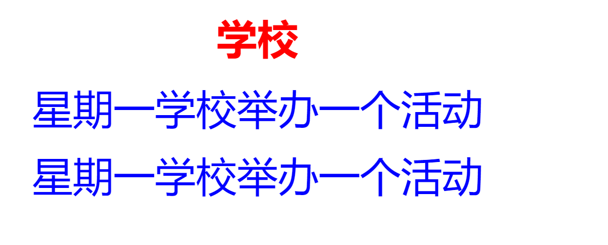
# CSS来上场
这样代码太多了有麻烦 

    <h3 align="center"  >学校</h3>
    
星期一学校举办一个活动

>### 语法格式：
    >* css 是写在一对   里面的，把这个样式放到 /head上面 
    >* 选择器/标签{属性1：属性1的值；属性2：属性2的值；属性3：属性3的值}         
    >* h3{color: blue;font-size: 100px;text-align: center;} 
    >
    >>1. 文本颜色 color：pink;
    >>>
    >>2. 文本的大小 font-size:60px;注意记得带 pc单位
    >>
    >>3. 文本对齐 text-align:
    >>
    >>4. 居中对 text-align:center
# 文字三属性    
> 文字控制三属性
    >1. 颜色 color:red;
    >2. 字号 font-size: 12px; 网页里面最小的字号是 12px
    >3. 字体 font-family: "宋体"，----记得这个字体外面有个双引号--规范
    
    <!DOCTYPE html>
    ​   <html lang="en">
    ​   <head>
    ​       <meta charset="UTF-8">
    ​       <meta name="viewport"   ​  content="width=device-width,  ​   initial-scale=1.0">
    ​       <title>Document</title>
    ​       
    ​   </head>
    ​   <body>
    ​       
我是段落标签

    ​       <ul>
    ​           <li>我是无序列表</li>
    ​       </ul>
    ​       <h3>我是标题3</h3>
    ​       
    ​   </body>
    ​   </html>

运行
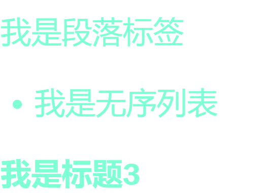
# 实体化三属性
> 实体属性
    >1. 宽度 width:600px
    >2. 高度 height:300px
    >3. 背景色 background:pink
    

    <body>
        <h3>我是标题3</h3>
        <h5>我是标题3</h5>
        <h6>我是标题6</h6>
        <ul>
            <li>我是无序列表</li>

        </ul>
        <dl>
            <dt>项目名称</dt>
            <dd>项目描述</dd>
        </dl>
    </body>
    
> ul 是父亲 ，li 是孩子
> 
> li 的width 和 height 不能大于ul 的

        ul{
            width: 800px;
            height: 600px;
            background: purple;
        }
        li{
            width: 600px;
            height: 500px;
            background: green;
        }
运行

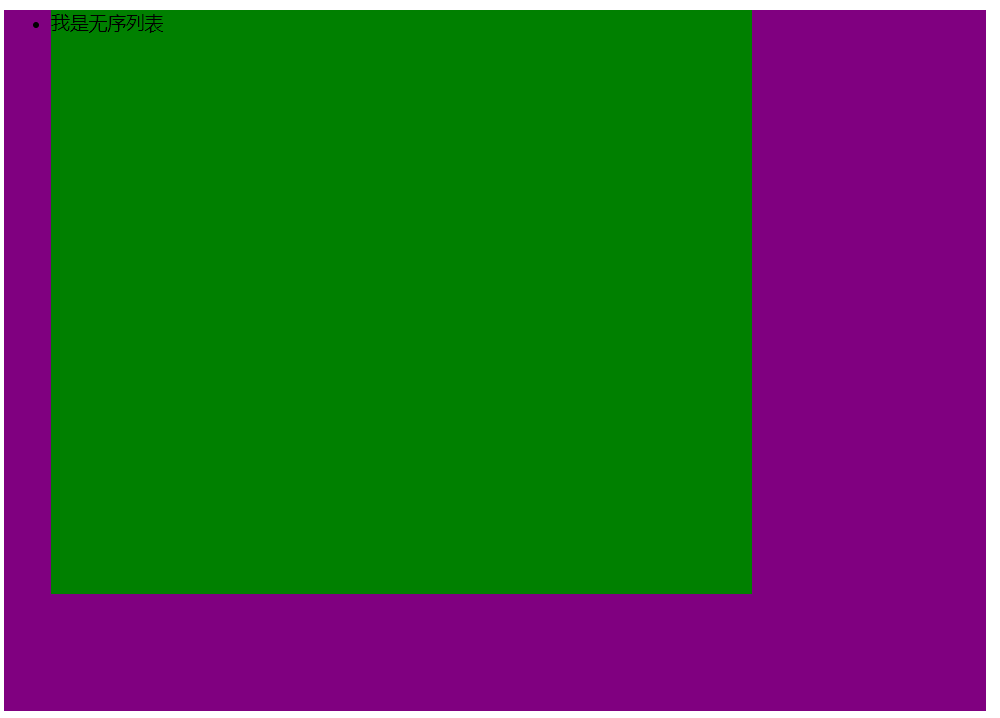

>* dl 是父亲 ，dt 和 dd 是孩子
>* dt 和 dd 不能大于父亲
>>* dt 和 dd 的宽度可以样
>>* dd 的高度最多 dt 和 dd 的高度 加一起等于dl的高度
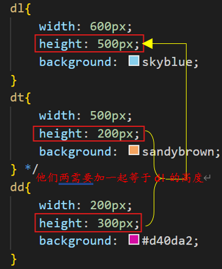

* 当只有 dl 的属性的时候
  
        dl{
                width: 600px;
                height: 500px;
                background: brown;
            }
    运行
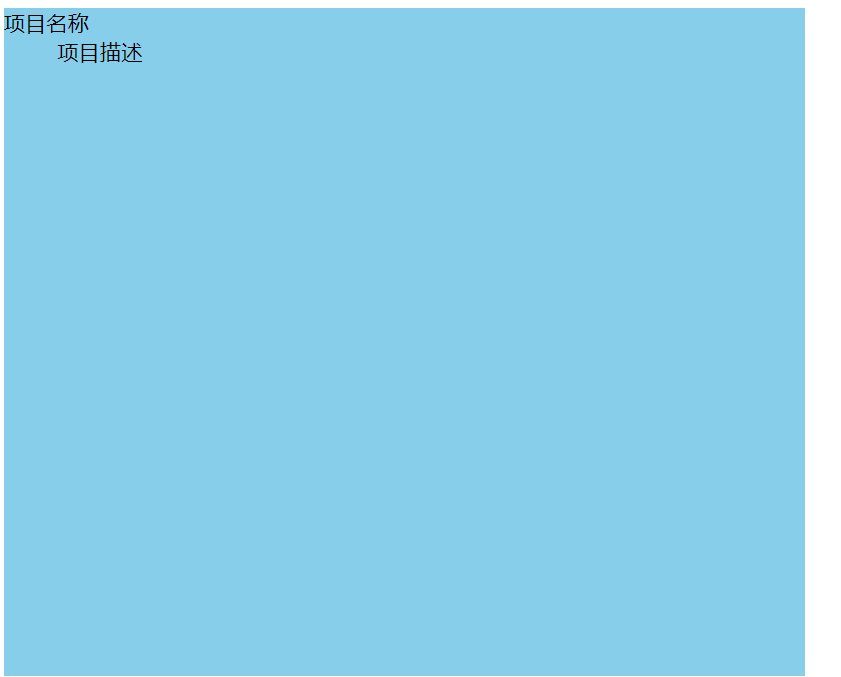

* 当有 dl 和 dd 的属性

        dl{
                  width: 600px;
                  height: 500px;
                  background: skyblue;
              }
              dt{
                  width: 500px;
                  height: 200px;
                  background: sandybrown;
              } 
    运行
    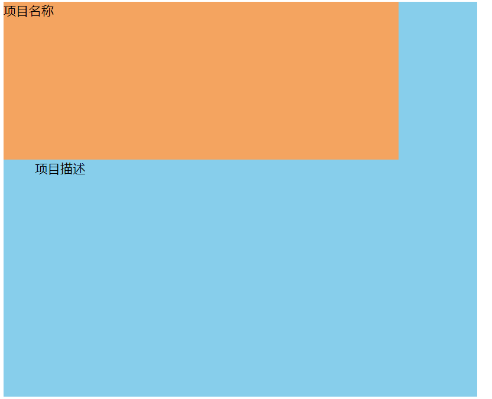
   
* 当有 dl , dt 和 dd 的属性一起

        dl{
            width: 600px;
            height: 500px;
            background: skyblue;
        }
        dt{
            width: 500px;
            height: 200px;
            background: sandybrown;
        }
        dd{
            width: 200px;
            height: 300px;
            background: #d40da2;
        } 

    运行

    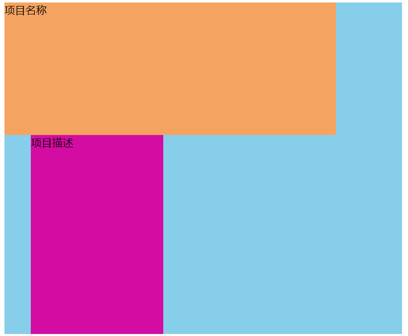
# 重点不写宽度和高度的显示模式 span & div
>* 我们的显示模式比较典型的有两种：行内元素 和 块级元素
>* 最常见的行内元素 span, 最常见的块级元素是 div
    >>1. 行内元素 span 是小盒子，小容器就是用来放一些小图片或者修饰性的一些内容
    >>2. 块级元素 div 是大盒子，大容器---他是主要用来做网页布局的，因为 div 比较稳定，一般在网页里面使用频率最高的，布局是离不开 div 的

    
大盒子

    
大盒子

    小盒子
    小盒子

    div{
        background: pink;
    }
    span{
        background: blueviolet;
    }
运行 
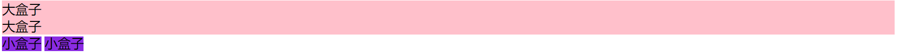

* 第一情况 如果不写宽度和高度
    * 块级元素：大盒子 div 他会独占一行并且通栏显示
    * 行内元素：小盒子 span 他会一行并存，显示文字的大小，或者说文字的多少

    运行
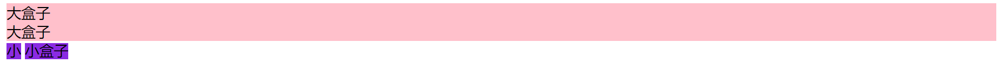
# 重点写了宽度和高度显示模式 span & div
* 第一情况 如果不写宽度和高度
    * 块级元素：大盒子 div 他会显示你给的宽度和高度大小，一句话就是宽度和高度起作用。
    * 行内元素：小盒子 span 就算他给你了宽度和高度他也不会起作用。
  
            
大盒子

            
大盒子

            小
            小盒子

            div{
                background: pink;
                width: 500px;
                height: 300px;
            }
            span{
                background: blueviolet;
                width: 500px;
                height: 300px;

            }
        
        运行
       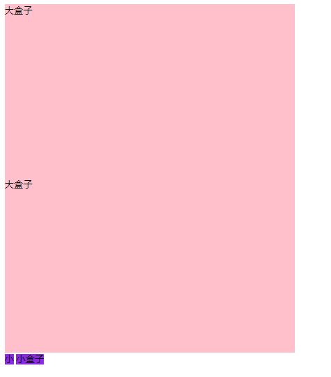 
# 解决显示模式问题 span & div
* 显示模式之间的转换 display 
    *  display:block; 就是把行内元素转换为块级元素 重点
    *  display: inline; 就是把块级元素转换为行内元素， 用的较少知道就行
   
            
大盒子

            
大盒子

            小
            小盒子

    * 上大招 ： display：block; 他能让你的行内元素宽度和高度起作用 
    
            span{
                background: blueviolet;
                width: 500px;
                height: 300px;
                display: block;

            }
        运行
        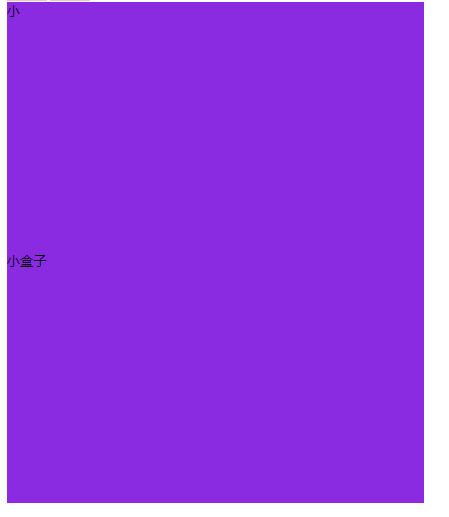
    * div
            
            div{
                background: pink;
                width: 500px;
                height: 300px;
                display: inline;
            }
        运行
        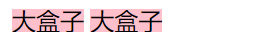
# 大招区分行内和块元素
> 区分行内和块级元素的方法：
>1. 方法一：任意去写一个标签，写上宽度和高度，如果起作用了，那么他就是块级元素
>2. 方法一：任意去写一个标签，写上宽度和高度，如果起作用了，那么他就是行内元素
        
    
    </head>
    <body>
        
我是div

        
我是段落

        我是span
        <i>我是倾斜</i>
        <em>我是倾斜</em>
    </body>

运行
    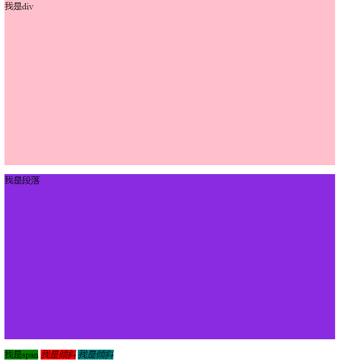
# 大招行内块

 布局要求：一行并存并且显示宽度和高度

    <!DOCTYPE html>
    <html lang="en">
    <head>
        <meta charset="UTF-8">
        <meta name="viewport" content="width=device-width,initial-scale=1.0">
        <title>Document</title>
        
    </head>
    <body>
        <!-- 
            布局要求：一行并存并且显示宽度和高度
        -->
            
我是块级元素

            
我是块级元素

            
我是块级元素

            我是行内元素
            我是行内元素
            我是行内元素
    </body>
    </html>
运行
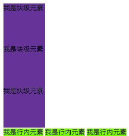
* div 和 span 都有display: inline-block;，他们俩都有作用
* display:inline-block; 技能显示大小又能一行并存--完美
        

        div{
            width: 100px;
            height: 100px;
            background: rebeccapurple;
            display: inline-block;
        }
        span{
            width: 100px;
            height: 100px;
            background: lawngreen;
            display: inline-block;
        
        }     
运行
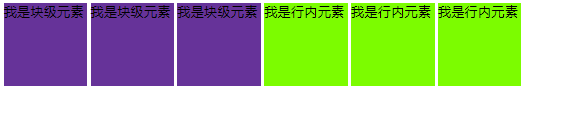       
* div 和 span 都有display: block;，只有span 起作用，div 没有

        div{
            width: 100px;
            height: 100px;
            background: rebeccapurple;
            display: block;
        }
        span{
            width: 100px;
            height: 100px;
            background: lawngreen;
            display: block;
        
        }
运行
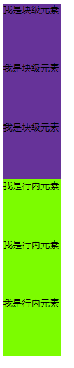
# 类选择器
* 我们的css 基础有三种： 标签选择器，类选择器，ID选择器
> 类选择器--重点
        >* 第一， 定义规则：用点(.) 后面跟26个任    意英文字母，最好小写
        例如：.box{} .mumu{} .xiaoyang{}
        >* 第二，调用规则 < class = "box"></ div>

       
    </head>
    <body>
        <ul>
            <li class="one">我是无序列表<li>
            <li class="two">我是无序列表<li>
            <li class="three">我是无序列表<li>
        </ul>
    </body>
运行
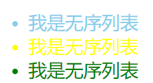
# google的logo的应用
    
    </head>
    <body>
        g
        o
        o
        g
        l
        e
    </body>
运行
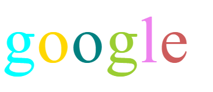
# 多个类的应用.html

     
    </head>
    <body>
        
亚 洲

        
非洲

        < class="fontWeight font16 " >欧洲</ div>
        
澳大

        < class="fontWeight  font16 ">美洲</ div>
        
绿洲

    </body>
运行
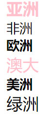    

# 选择器的权重

>回顾：标签选择器，类选择器，id 选择器
>公式：标签选择器 < 类选择器 < id 选择器
        1 < 10< 100

    
    </head>
    <body>
        <!-- 
        -->
        
看看我到底是什么颜色奥？

    </body>
运行     
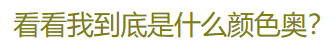