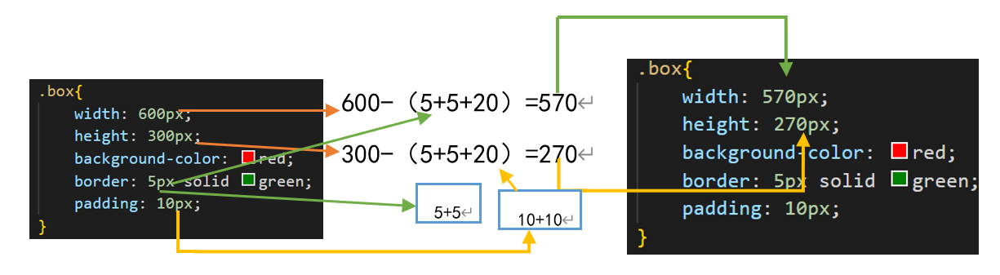

# 边框样式border

> 语法格式：border:1px solid pink; --- 严格按照这个顺序来书写---规范
> border: 线的大小 实线/虚线 线的颜色

    

 
    

 
    

 
    .one{
            width: 300px;
            height: 150px;
            /* 复合写法 */
            border: 1px solid pink;
        }
运行
    
* border 线类型有 
    * solid 实线
    * dashed 虚线
    * dotted 点线

            .two{
                width: 300px;
                height: 150px;
                /* dashed 虚线 */
                border: 1px dashed green;
                /* 扩展 dotted 点线 */
                /* border: 1px dotted red; */
            }
    运行
    
* border 的上下左右边框有
    * border-top
    * border-right
    * border-bottom
    * border-left   

            .three{
            width: 300px;
            height: 150px;  
            border-top: 1px solid blue;
            border-right: 5px solid red;
            border-bottom: 10px solid green;
            border-left: 15px solid yellow;
            }
    运行
    
# css的层叠性      
 总结：我们的css层叠性就是后写样式会覆盖先写样式（必须保证权重相同的情况下）

    
看看我们的文字到底是什么颜色！

    .box{
            color: blue;
            width: 300px;
            height: 150px;
            border: 2px solid green;
            color:red;
        }
运行

    .box{
            color: blue;
            width: 300px;
            height: 150px;
           
            color:red;
        }
运行

    .box{
            color: blue;
            width: 300px;
            height: 150px;
            border: 2px solid green;
            color:red;
        }
        .box{
            color: brown;
             
        }
运行

    .box{
            color: blue;
            width: 300px;
            height: 150px;
            border: 2px solid green;
            color:red;
        }
        .box{
            color: brown;
             
        }
        div{
            color:purple；
        }
运行

# css的续承性
总结: 我们的css可以实现续承性, 子盒子会续承父盒子的样式(一般都是继承父盒子的颜色)

    

        
我是box的孩子

        我是box的孩子
    

    .box{
        width: 600px;
        height: 300px;
        color: pink;
        font-size: 30px;
        border: 2px solid red;
        }
运行

# 行高效果line-height
 alt + z 换行

* 总结：line-height: 24px; 不仅能控制行与行之间的距离，他还有一个大招

        

            LONDON, Aug 9 (Reuters) - Britain announced a new package of sanctions against Belarus on Friday, saying four individuals and three entities had been targeted over human rights violations and the ongoing facilitation of Russia's invasion of Ukraine.The British government said the coordinated action with international partners marked the fourth anniversary of the 
        

        .box1{
            width: 600px;
            height: 300px;
            border: 1px solid green;
            line-height: 20px;
            
        }
    运行

* 可以控制单行文字的垂直居中（高度是多少行高就给多少，就能控制单行文字的垂直居中）

        
我是导航

        .box2{
            width: 300px;
            height: 100px;
            line-height: 100px;
            background: red;
            text-align: center;
        }
    运行
    
# 盒子模型
>我们的盒子模型：宽度，高度，边框，外边距和内边框
        >* 外边距----margin 控制盒子外面的距离
        >* 内边距----padding 控制盒子外面的距离

    
文字内容

* 盒子居中 margin:0px auto; 公式 简化 margin:0px auto;
    
        .box{
            width: 300px;
            height: 200px;
            border: 2px solid red; 
            /* 盒子居中 */
            margin: 0 auto;
        }
    运行

# 内边框的不同值写法
>1. 单值写法：padding: 10px；就是代表了4个值，上下左右都是10px；
>2. 双值写法：padding: 10px 30px;第一个代表上下，第二个值代表左右
>3. 三值写法：padding:10px 30px 60px; 第一个值代表上，第二个值代表左右，第三个值代表下；
>4. 四值写法：padding: 10px 0px 50px 80px; 上右下左---顺时针

    
单值写法

    
双值写法

    
三值写法

    
四值写法

    .box1{
            border: 1px solid red;
            display: inline-block;
            padding: 10px;
        }
        .box2{
            border: 1px solid red;
            display: inline-block;
            padding: 10px 30px;
        }
        .box3{
            border: 1px solid red;
            display: inline-block;
            padding: 10px 30px 60px;
        }
        .box4{
            border: 1px solid red;
            display: inline-block;
            padding: 10px 30px 50px 80px;
        }
运行
    

>内边距和外边距同理
    >1. 单值写法：margin: 10px；就是代表了4个值，上下左右都是10px；
    >2. 双值写法：margin: 10px 30px;第一个代表上下，第二个值代表左右
    >3. 三值写法：margin:10px 30px 60px; 第一个值代表上，第二个值代表左右，第三个值代表下；
    >4. 四值写法：margin: 10px 0px 50px 80px; 上右下左---顺时针

# 给body加背景图
>语法格式：
>* background:可以加背景色，还可以加背景图
>* url图片的路径
>* 默认的是重复的，如果想不重复，后面加 no-repeat---不平铺
* background: url("img/01.jpg") ;   

         body {
            height: 1000px;
            background: url("img/01.jpg") ;
        }
    运行

* background: url("img/01.jpg") no-repeat;

        body {
            height: 1000px;
            background: url("img/01.jpg") no-repeat;
        }
    运行

# 给盒子加背景图  
>### 语法格式：
>* background:可以加背景色，还可以加背景图
>* url图片的路径>*默认的是重复的，如果想不重复，后面加 no-repeat---不平铺\
>### 水平位置和垂直位置
>* 第一个值代表水平位置：左 left 中 center 右 right
>* 第二个值代表垂直位置： 上 top 中 center 下 bottom

> 推荐大家使用复合写法 
>background: url("img/01.jpg") no-repeat 100px 50px; 
        
        

* background: url("img/01.jpg") no-repeat center center;

        .box{
            width: 800px;
            height: 600px;
            border: 1px solid red;
            margin: 0 auto;
            /* 复合写法 */
            background: url("img/01.jpg") no-repeat center center;
         }
    运行
    
* background: url("img/01.jpg") no-repeat left bottom;

        .box{
            width: 800px;
            height: 600px;
            border: 1px solid red;
            margin: 0 auto;
            /* 复合写法 */
            background: url("img/01.jpg") 
        }
    运行
    

* background: url("img/01.jpg") no-repeat 100px 50px;

        .box{
            width: 800px;
            height: 600px;
            border: 1px solid red;
            margin: 0 auto;
            /* 复合写法 */
            background: url("img/01.jpg") no-repeat 100px 50px;
        }
    运行
               

>扩展分解写法 
    >* background-color: pink; 
    >* background-image:url("img/01.jpg");
    >* background-repeat: no-repeat;
    >*  background-position: 100px 50px;

    .box{
            width: 800px;
            height: 600px;
            border: 1px solid red;
            margin: 0 auto;
            background-color: pink; 
            background-image:url("img/01.jpg");
            background-repeat: no-repeat;
            background-position: 100px 50px;
        }
运行
    
# 扩展内边距和边框变大的问题.html
> 我们的内边框和边框是会把盒子变大的，我们的盒子是不能让他变大的，解决方案一：内减法（外边距不需要内减，只有边距和内边距）

> 总结：只要给了盒子加了边框和内边距那么这个盒子一定会变大的，所以我们要减去你给的边框和内边距大小的值，如果盒子变大了，下面的内容就是别挤下去，记住了：给了边距和内边距别忘了减去响应的值

    

    .box{
            width: 570px;
            height: 270px;
            background-color: red;
            border: 5px solid green;
            padding: 10px;
        }

运行

# 小学数学题
> width: 588px;
            height: 288px;

    

    .box{
            width: 588px;
            height: 288px;
            border: 1px solid #000;
            padding: 5px;

        }
# 中学数学题
    

    .box{
            width: 492px;
            height: 294px;
            border: 2px solid red;
            padding: 1px 2px;

        }

# 高中数学题.html
    

    .box{
            width: 559px;
            height: 279px;
            border: 3px solid red;
            padding: 5px 10px 15px 20px;

        }

运行

#  后代选择器

> 总结: 后代选择器，用的是空格，一个空格--规范
    <ul>
        <li>我是无序列表</li>
        <li>我是无序列表</li>
        <li>我是无序列表</li>
        <li>我是无序列表</li>
    </ul>
    <ol>
        <li>我是有序列表</li>
        <li>我是有序列表</li>
        <li>我是有序列表</li>
        <li>我是有序列表</li>
    </ol>
    

        
我是div的孩子

    

    
我是段落标签

    
 运行
    
# 并集选择器
>  并集选择器：用的是逗号

        
文字

        文字
        <h3>文字</h3>
        <h5>文字</h5>
        <h6>文字</h6>
        
运行

# 标签指定选择器
>* 总结： 标签选择器， 类选择器，id选择器，后代选择器，并集选择器，标签指定选择器
>* 经典面试题： 标签指定选择器（交集选择器）标签后面直接跟类--不能加逗号和空格
   
    
我是第一个

    
 我是第二个

    
我是第三个

    p.p1{
            color: red;
        }

运行
    