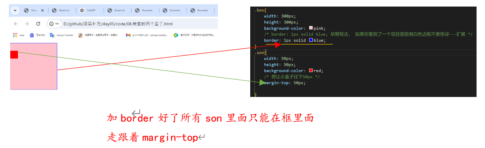
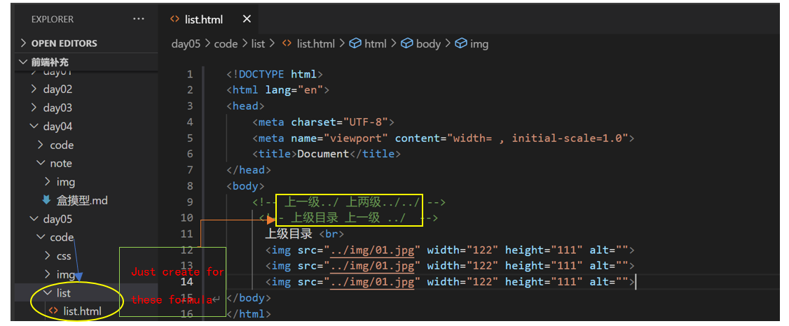

# 行内式样式表
总结：我们的行内式样试表就是把样式写在标签后面的 
      
    
我是文字内容

        我是文字内容
运行

# 内嵌式样试表

总结：我们的内嵌式样试表写在一对<*style></*style >里面的放到/head上面的

    <ul>
        <li>我是无序列表</li>
        <li>我是无序列表</li>
        <li style="color: blue;">我是无序   表</li>
        <li>我是无序列表</li>
        <li>我是无序列表</li>
    </ul>
     li{
            color: red;
        }
运行
     
#  外链式样式表
我们的样式表：行内式样式表，内嵌式样试表，外链式样式表（在工作里面做开发的时候天天用）

        外链式步骤
        1.新建一个 html 的页面
        2.单独独立一个 css的文件夹,里面建立一个css的文件，扩展名必须是.css 例如 index.css

    首页命名规范 index 代表是首页
        
        3.最后别忘了链接外部的css文件     <link rel="stylesheet" href="css/index.css">

        外链式的优势： 真正的实现了结构html与表现css两者相分离--工作要求：专业的做专业事

* 在 03.外链式样式表.html 文件

        
我是div标签

        
我的box盒子

* 在 index.css 文件

        div{
            color: red;
        }
        .box{
            width: 300px;
            height: 300px;
            background-color: green;
            color: yellow;
        }
运行

# 溢出隐藏 （overflow）
>* 溢出隐藏
overflow:hidden;
overflow: auto; 
overflow: scroll;
overflow: visible;

     

        
    

    
Former U.S. President Barack Obama and his wife Michelle Obama delivered 
        a one-two punch at the Democratic National Convention on Tuesday night, 
        urging Americans to back Kamala Harris in her 11th-hour presidential bid 
        against Republican Donald Trump.

* overflow: hidden;  溢出隐藏 ， 最常用的，这个是代码界的大神，以后很多很多经典bug都是用这个溢出隐藏可以完美解决 

        .box{
            width: 170px;
            height: 200px;
            border: 1px solid #000;   
            overflow: hidden;
        }
    运行

* overflow:hidden; 溢出隐藏，大白话: 就是把多余的部分切除掉，这个很正常 
            
        p{
            width: 170px;
            height: 180px;
            border: 1px solid #000;
            overflow:hidden; 
        }
    运行 

* overflow: auto;  把多余的部分以滚动条的形式展示 

       p{
            width: 170px;
            height: 180px;
            border: 1px solid #000;
            overflow: auto; 
        }    
    运行
    

* overflow: scroll; 用的少

        p{
            width: 170px;
            height: 180px;
            border: 1px solid #000;
            overflow: scroll; 
        } 
    运行
    

* overflow: visible; 默认值

        p{
            width: 170px;
            height: 180px;
            border: 1px solid #000;
            overflow: visible; 
        } 
    运行
    

# 简单的导航效果
    <a href="#">公司简介</a>
    <a href="#">公司产品</a>
    <a href="#">联系方式</a>
    <a href="#">关于</a>
* text-decoration: none; 去除a链接的下划线 none 无 没有

        a{
            color: rebeccapurple;
            text-decoration: none;
        }
   运行
   
* text-decoration: underline; 给a链接添加上下划线
* a:hover{} 鼠标经过效果

        a:hover{
            color: skyblue;
            text-decoration: underline;
        }
    运行
    

# 图片切换导航效果 
> nav 代表导航 

    

        <a href="#">首页</a>
        <a href="#">文章</a>
        <a href="#">播客</a>
        <a href="#">论言</a>
        <a href="#">练习</a>
        <a href="#">参考</a>    
     

     
运行

* 你的鼠标到nav bar 的时候他会出现背景和下线
> 加粗还可以给数字，注意不要带单位 
>font-weight: 600;

    .nav{
            text-align: center;
        }
        a{
            width: 88px;
            height: 42px;
        /* 在这里的no-repeat也可以不加因为上面的a （width 和 height )已经压了， 一般需要加 */
            background: url("img/02.jpg") no-repeat;
            display: inline-block;
            line-height: 42px;
            color: #3e3e3e;
            text-decoration: none;
            font-size: 18px;
            /* font-weight: bold; */
            font-weight: 600;
        }
        a:hover{
        /* 在这里的no-repeat也可以不加因为上面的a （width 和 height )已经压了， 一般需要加 */
            background: url(img/03.jpg) no-repeat;
            text-decoration: underline;
        }

运行 

# 外边距塌陷（合并）并列的两个盒子
> 第一种情况：如果是并列的两个盒子，那么他会以最大那个外边距来计算，正常，所有的浏览器都是以最大的那个外边距来计算的。

    

    

 
    .box1{
            width: 300px;
            height: 300px;
            background-color: pink;
            margin: 100px;
        }
        .box2{
            width: 300px;
            height: 300px;
            background-color: red;
            margin-left: 100px;
            margin-top: 200px;
        }
运行
 
# 嵌套的两个盒子
* 第二情况：嵌套的两个盒子就会真正的出现bug 错误 外边距塌陷
* 我们只是给小盒子加了外边距，他竟然把父盒子带跑了-------这个在工作里面不允许的

> 如果面试官问到你最好回答两种以前的写法和现在的写法----可以加新
>>1.早期写法， 给父盒子加一个白色的边框，不推荐，留给面试官来问
>2.大招 给父盒子加 overflow: hidden; ---很强大，推荐使用

        

        

        

        .box{
            width: 300px;
            height: 300px;
            background-color: pink;
            /* border: 1px solid blue; 早期写法， 如果你看到了一个项目里面有白色边框不要惊讶---扩展 */
            /* border: 1px solid blue; */
            overflow: hidden;
        }
        .son{
            width: 50px;
            height: 50px;
            background-color: red;
            /* 想让小盒子往下50px */
            margin-top: 50px;
            
        }
### origin

### 我们只是给小盒子加了外边距，他竟然把父盒子带跑了-------这个在工作里面不允许的

### 早期写法， 给父盒子加一个白色的边框，不推荐，留给面试官来问

### 大招 给父盒子加 overflow: hidden; ---很强大，推荐使用

# 扩展路径详细

> 我们的路径：相对路径和绝对路径
> 我们的相对路径： 分为-----同级目录，下级目录和上级目录

> 同级目录：就是图片和页面能互相看到

    

> 下级目录：我们案例和项目里面最常用的的都是下级目录，就是把图片放到images文件夹里面，我们的案例一直在用 

    
    
    
运行

# list
>上一级../ 上两级../../     
>上级目录 上一级 ../ 

    上级目录  
      
      
      

运行

 
## san er ji
> 上一级是../ 上两级../../

    
     

运行

# 绝对路径了解即可
>  绝对路径带盘符--了解即可

    
    
> 假设我们图片在E盘 如果发送文件，别人想要看到你的图片，你要把你的电脑送给他 

# CSS初始化
    

    <ul> 
        <li>我是无序列表</li>
        <li>我是无序列表</li>
        <li>我是无序列表</li>
        <li>我是无序列表</li>
        <li>我是无序列表</li>
    </ul>

运行

    ul,ol{
        /* 清楚列表样式 */
        list-style: none;
    }
    </style>
    <ul> 
        <li>我是无序列表</li>
        <li>我是无序列表</li>
        <li>我是无序列表</li>
        <li>我是无序列表</li>
        <li>我是无序列表</li>
    </ul>

运行

>  *通配符（全局规则选择器）---这个通配符权重最低
> 权重 * < 标签选择器 < 类选择器 < id 选择器

    
    <ul> 
        <li>我是无序列表</li>
        <li>我是无序列表</li>
        <li>我是无序列表</li>
        <li>我是无序列表</li>
        <li>我是无序列表</li>
    </ul>
运行

    