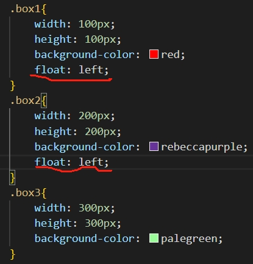
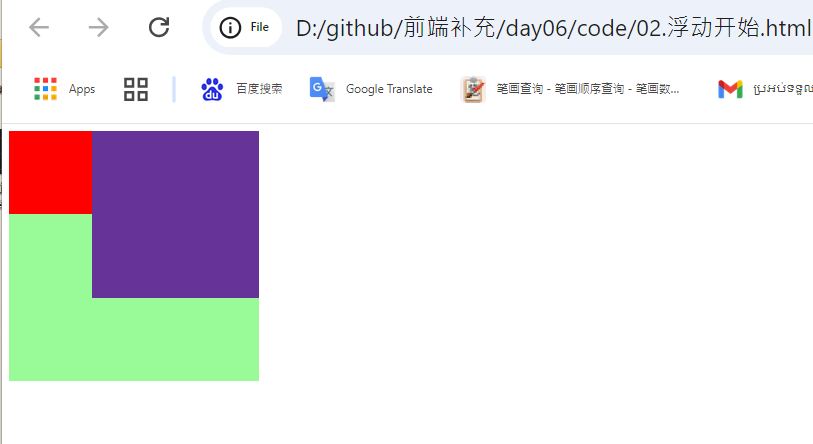
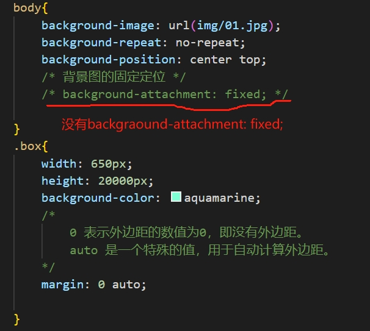
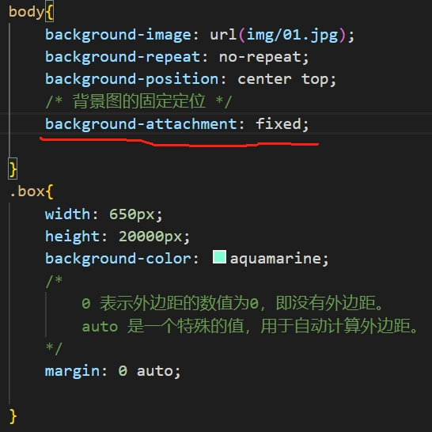
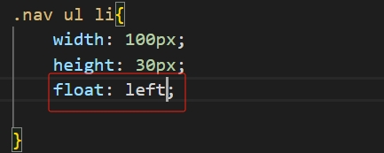
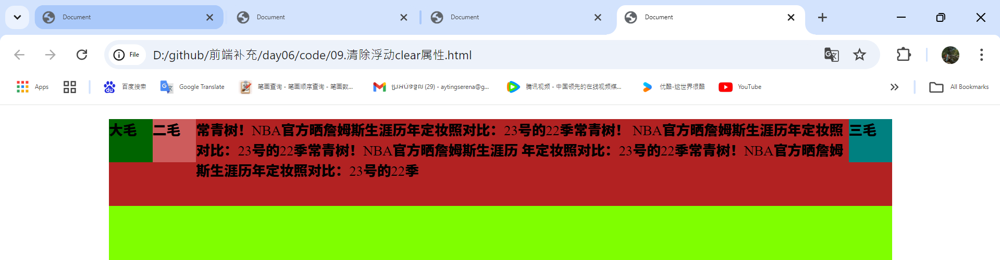
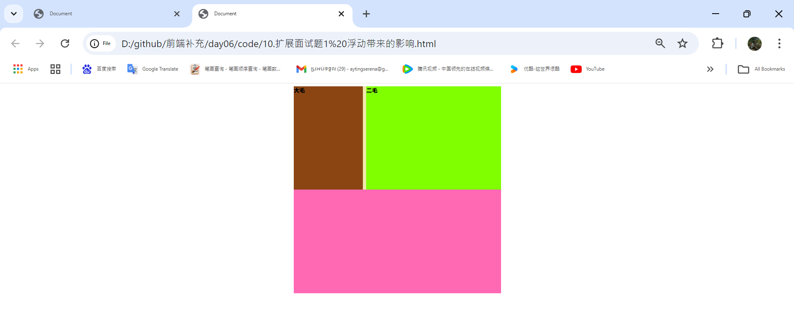

# 标准流
* 网页的三大流派
* 中华武术的三大流派：少林，武当
* 我们的网页也有三大流派：标准流（文档流），浮动流，定位流
* 特点： 我们的标准流的特点：块级元素独占一行，行内元素一行并存（我们前面案例的特点）

        
        
我是div的盒子

        
我是div的盒子

        
我是div的盒子

        
我是div的盒子

        
我是div的盒子

        
我是div的盒子

        我是span的盒子
        我是span的盒子
        我是span的盒子
        我是span的盒子
        我是span的盒子
        我是span的盒子

    运行
    

    > 浮动流是非常的重要：项目是离不开浮动，我们的浮动有两个特性比较的重要
        1.float: left;左浮动（左对齐）
        2.float: right;右浮动（右对齐）
        注意： 浮动是没有居中的，盒子居中ZMargin：0 auto;

# 浮动开始
       
> 注意：项目里面很多时候都是有标准流也有浮动流和定位流
         

     
    </head>
    <body>
        
 

        
 

        
 

    </body>

运行

    
### code
    
 运行
 

> 如果一个页面既有标准流又有浮动流，那么是浮动流压着标准流（大白话：就像水里的浮漂，会飘在水面的）----一句话： 就是浮动流会压着标准流

 
 运行
 

>总结：如果都是浮动流就会按照顺序自动排列（大白话：就像我们去食堂吃饭一样，线来先得）

 
 运行
 

 
 运行
 

 # 扩展字体的复合写法

>  注意：字号和字体是缺一不可的，严格按照老师的顺序来书写--规范
   > *   字体和字号是必须有的，缺一不可，其他的可以省略的。

    
        </head>
        <body>
            
今天天气很好

        </body>
    
运行

# 扩展背景图的固定定位
    
    </head>
    <body>
    

        
大家好好跟着我学习代码，每天都要来直播间效果更好，棒棒哒

        
大家好好跟着我学习代码，每天都要来直播间效果更好，棒棒哒

        
大家好好跟着我学习代码，每天都要来直播间效果更好，棒棒哒

        
大家好好跟着我学习代码，每天都要来直播间效果更好，棒棒哒

        
大家好好跟着我学习代码，每天都要来直播间效果更好，棒棒哒

        
大家好好跟着我学习代码，每天都要来直播间效果更好，棒棒哒

        
大家好好跟着我学习代码，每天都要来直播间效果更好，棒棒哒

        
大家好好跟着我学习代码，每天都要来直播间效果更好，棒棒哒

        
大家好好跟着我学习代码，每天都要来直播间效果更好，棒棒哒

        
大家好好跟着我学习代码，每天都要来直播间效果更好，棒棒哒

        
大家好好跟着我学习代码，每天都要来直播间效果更好，棒棒哒

        
大家好好跟着我学习代码，每天都要来直播间效果更好，棒棒哒

        
大家好好跟着我学习代码，每天都要来直播间效果更好，棒棒哒

        
大家好好跟着我学习代码，每天都要来直播间效果更好，棒棒哒

        
大家好好跟着我学习代码，每天都要来直播间效果更好，棒棒哒

        
大家好好跟着我学习代码，每天都要来直播间效果更好，棒棒哒

        
大家好好跟着我学习代码，每天都要来直播间效果更好，棒棒哒

        
大家好好跟着我学习代码，每天都要来直播间效果更好，棒棒哒

        
大家好好跟着我学习代码，每天都要来直播间效果更好，棒棒哒

        
大家好好跟着我学习代码，每天都要来直播间效果更好，棒棒哒

        
大家好好跟着我学习代码，每天都要来直播间效果更好，棒棒哒

    

### 没有 background-attachment: fixed;
    
运行 
<video controls src="img/13.mp4" title="Title"></video>

### 有 background-attachment: fixed;

    > 因为有background-attachment: fixed让background image repeat

运行 
<video controls src="img/15.mp4" title="Title"></video>

### 推荐这个优化写法--完美加薪 

    background: url(img/01.jpg) no-repeat center top fixed;

# 在线导航效果

    

        <ul>
            <li><a href="#"> 公司简介</a></li>
            <li><a href="#"> 公司简介</a></li>
            <li><a href="#"> 公司简介</a></li>
            <li><a href="#"> 公司简介</a></li>
            <li><a href="#"> 公司简介</a></li>
            <li><a href="#"> 公司简介</a></li>
            <li><a href="#"> 公司简介</a></li>
            <li><a href="#"> 公司简介</a></li>
        </ul>
    

           
运行

### CSS初始化 reset
      
运行
    

### hover

    运行
    <video controls src="img/20.mp4" title="Title"></video>

### CSS初始化 结束 
#### 导航开始 

    

    

        <ul>
            <li><a href="#"> 公司简介</a></li>
            <li><a href="#"> 公司简介</a></li>
            <li><a href="#"> 公司简介</a></li>
            <li><a href="#"> 公司简介</a></li>
            <li><a href="#"> 公司简介</a></li>
            <li><a href="#"> 公司简介</a></li>
            <li><a href="#"> 公司简介</a></li>
            <li><a href="#"> 公司简介</a></li>
        </ul>
    

运行

    
##### nav ul li

##### float: left;

    

    
   运行
   

    
This is the reason make the first change

<video controls src="img/33.mp4" title="Title"></video>

when they don't have  color 

<video controls src="img/32.mp4" title="Title"></video>

上大招：又学一招

    

 

 运行
<video controls src="img/35.mp4" title="Title"></video>

# 扩展通栏导航效果

    

运行
<video controls src="img/37.mp4" title="Title"></video>

    

运行

    
have border

don't have border

# 扩展带logo的导航效果
    

    运行
    

<video controls src="img/46.mp4" title="Title"></video>

#### 又学会一招独立控制导航的a链接的样子-- 这一招非常好用的

    

运行
<video controls src="img/48.mp4" title="Title"></video>

# 网站估计开始
    

运行
<video controls src="img/49.mp4" title="Title"></video>

* 没有float 的时候盒子开始乱

运行
<video controls src="img/51.mp4" title="Title"></video>

    <body>
    <!-- header 开始 -->
    
 header

    <!-- header 结束 -->
    <!-- nav 开始-->
    
 nav 

    <!-- nav 结束-->
    <!-- banner 开始 -->
     

    <!-- banner 结束 -->
    <!-- content 开始 -->
     

        
left

        
right

     

    <!-- content 结束 -->
    <!-- footer 开始  -->
    
 footer

    <!-- footer 结束  -->
    </body>

加这两个就整齐了
    
    
运行
<video controls src="img/54.mp4" title="Title"></video>

# 清除浮动clear属性
    
    <body>
    

        
大毛

        
二毛

        
三毛

        
常青树！NBA官方晒詹姆斯生涯历年定妆照对比：23号的22季常青树！
            NBA官方晒詹姆斯生涯历年定妆照对比：23号的22季常青树！NBA官方晒詹姆斯生涯历
            年定妆照对比：23号的22季常青树！NBA官方晒詹姆斯生涯历年定妆照对比：23号的22季

    

    </body>
运行
    

    
 
运行
    

    
    
   运行
   

   ### 优化代码写法 clear: both
    
   p{
            height: 100px;
            background-color: firebrick;
            /* 早期写法 */
            /* clear: left; 清除左浮动 */
            /* clear: right; 清除右浮动 */
            /* 优化代码写法--推荐使用 */
            clear: both; /*清除两端，两者都--推荐大家使用的--加薪  */
        }
    
运行
    

# 扩展面试题1 浮动带来的影响

需求： 首先有两个盒子，上下排列，第一个盒子里面有两个小盒子，并且第一个大盒子高度为自动auto 或者不写，里面小盒子必须是浮动的
    那么下面的大盒子一定会错位的，这个是一个经典的面试题 bug--面试被问到的几率很大 

     

        
 大毛

        
 二毛

    

    

    

运行

    
    

运行

你写代码有的时候你不知道高度应该多少

但是运行的时候 box2去box1 的位置

### 解决方案一： 溢出隐藏法 overflow
> 溢出隐藏解决清除浮动原理： overflow:hidden; 能检测到子盒子的高度并且把子盒子的高度赋值给父盒子（专业名词--BFC）
   

* 工作里面大量使用的 这一招--推荐使用的

        

运行

