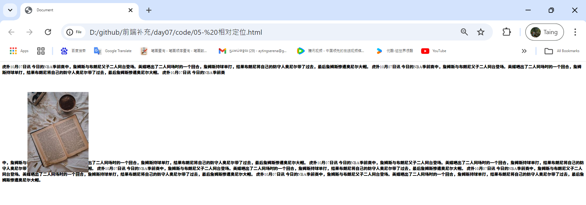
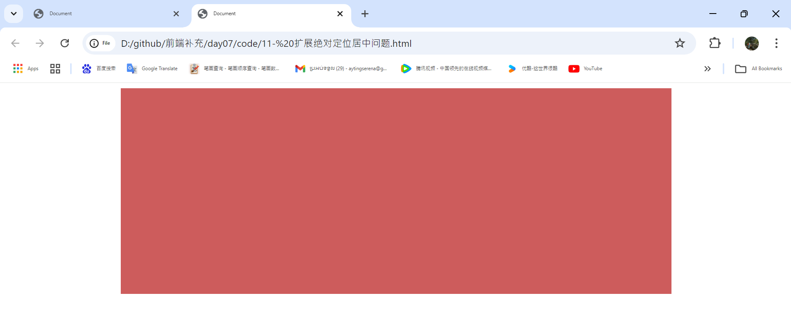

# 01-扩展面试题2清除浮动带来的影响

* 解决方案二： 额外标签法（专业名词--BFC）
* 举例：人类大约在地球还有1.2亿年以后就木有了， 任何的事物都是有始有终的，浮动又开始就应该有结束。

> 步骤：
> 1.先在最后的浮动下面加一个额外的标签
> 2.在上面写css样式 `.clear{clear:both;}` 

> 总结：在一些网站上面你会发现有这个额外标签 `<div class="clear"></div>` 目标就是为了解决这个bug的
 
 ```html
    <div class="box1">
        <div class="son1"> 大毛</div>
        <div class="son2"> 二毛</div>
        <div class="clear"></div>
    </div>
    <div class="box2"></div>
 ```
```css
    .box1 {
        background-color: #f0f0f0;
        border: 1px solid #ccc;
    }
    
    .son1 {
        float: left;
        width: 50%;
        background-color: #ff69b4;
    }
    
    .son2 {
        float: left;
        width: 50%;
        background-color: #33cc33;
    }
    
    .clear {
        clear: both;
    }
    
    .box2 {
        background-color: #666;
        height: 50px;
    }
```
   
运行


# 02- 扩展面试题3清除浮动带来的影响

> 需求： 首先有两个盒子，上下排列，第一个盒子里面有两个小盒子，并且第一个大盒子高度为自动auto 或者不写，里面小盒子必须是浮动的
    那么下面的大盒子一定会错位的，这个是一个经典的面试题 bug--面试被问到的几率很大 

``` html
 <div class="box1">
        <div class="son1"> 大毛</div>
        <div class="son2"> 二毛</div>
       
    </div>  
    <div class="box2"></div>
```
``` css
 .box1{
            width: 600px;
            height: auto;
            background-color: palegoldenrod;
            margin: 0 auto;
          
        }
        .son1{
            width: 200px;
            height: 300px;
            float: left;
            background-color: saddlebrown;
        }
        .son2{
            width: 390px;
            height: 300px;
            float: right;
            background-color: chartreuse;
        }
       
        .box2{
            width: 600px;
            height: 300px;
            background-color: hotpink;
            margin: 0 auto;
        }
   ```
运行
  

* 扩展大招：这个代码有点难，但是可以加薪

``` html
<div class="box1 clearfix">
        <div class="son1"> 大毛</div>
        <div class="son2"> 二毛</div>
       
    </div>  
    <div class="box2"></div>
```
```css
     .box1{
            width: 600px;
            height: auto;
            background-color: palegoldenrod;
            margin: 0 auto;
          
        }
        .son1{
            width: 200px;
            height: 300px;
            float: left;
            background-color: saddlebrown;
        }
        .son2{
            width: 390px;
            height: 300px;
            float: right;
            background-color: chartreuse;
        }
       
        .box2{
            width: 600px;
            height: 300px;
            background-color: hotpink;
            margin: 0 auto;
        }
      
        /* 上难度可以加薪 */
        .clearfix:after{   /* 这个是cs3 伪类写法，后面会单独有一节课来讲解这个伪类 */
            content: ''; /* 内容为空 */
            height: 0;/* 高度为0*/
            display: block;/* 转换为块*/
            visibility: hidden;/* 隐藏对象*/
            clear: both;/* 清除两端 */
            
        }
        /* 为了解决低版本浏览器兼容问题，比如 IE6 的兼容问题 */
        .clearfix{
            zoom: 1; /* 注意没有单位，这行代码是为了解决低版本浏览器兼容问题*/
        }
```
添加 这些


运行


# 03- 为了高新拼了
> 需求： 首先有两个盒子，上下排列，第一个盒子里面有两个小盒子，并且第一个大盒子高度为自动auto 或者不写，里面小盒子必须是浮动的
    那么下面的大盒子一定会错位的，这个是一个经典的面试题 bug--面试被问到的几率很大 
> 扩展大招：这个代码有点难，但是可以加薪

``` html
<div class="box1 clearfix">
        <div class="son1"> 大毛</div>
        <div class="son2"> 二毛</div>
       
    </div>  
    <div class="box2"></div>
```
```css
.box1{
            width: 600px;
            height: auto;
            background-color: palegoldenrod;
            margin: 0 auto;
          
        }
        .son1{
            width: 200px;
            height: 300px;
            float: left;
            background-color: saddlebrown;
        }
        .son2{
            width: 390px;
            height: 300px;
            float: right;
            background-color: chartreuse;
        }
       
        .box2{
            width: 600px;
            height: 300px;
            background-color: hotpink;
            margin: 0 auto;
        }
  /* 上难度可以加薪：这个也是伪类写法 -- 这些都是大厂的新技术--留给面试官*/
  .clearfix:before,.clearfix:after{
    display: table; /* 转换为表格*/
    content:'';/*内容为空*/
  }
  .clearfix:after{
    clear: both;/* 清除两端*/
  }

  /* 为了解决低版本浏览器兼容问题，比如 IE6 的兼容问题 */
  .clearfix{
            zoom: 1; /* 注意没有单位，这行代码是为了解决低版本浏览器兼容问题*/
        }
```

添加这些

-----------------------


运行


# 04- 静态定位
>  温故而知新：标准流，浮动和定位流

```html
<div>
        瑞典卡罗琳医学院宣布，将2024年诺贝尔生理学或医学奖授予科学家维克托·安布罗斯（Victor Ambros）和加里·鲁夫昆       （Gary Ruvkun），以表彰他们发现了mRNA（微小核糖核酸）及其在转录后基因调控中的作用。瑞典卡罗琳医学院宣布，将     2024年诺贝尔生理学或医学奖授予科学家维克托·安布罗斯（Victor Ambros）和加里·鲁夫昆（Gary 
    </div>
```
```css
  div{
            /* 默认的静态定位，布局默认的很少用，了解接口，在后面js会看到这个单词*/
            position: static;
        }  
```
运行


# 05- 相对定位
> 定位流：（静态定位，相对定位，绝对定位，固定定位）

```html
     <div class="box1">
        虎扑10月07日讯 今日的NBA季前赛中，詹姆斯与布朗尼父子二人同台登场。美媒晒出了二人同场时的一个回合，詹姆斯持球单打，结果布朗尼将自己的防守人奥尼尔带了过去，最后詹姆斯惨遭奥尼尔大帽。 虎扑10月07日讯 今日的NBA季前赛中，詹姆斯与布朗尼父子二人同台登场。美媒晒出了二人同场时的一个回合，詹姆斯持球单打，结果布朗尼将自己的防守人奥尼尔带了过去，最后詹姆斯惨遭奥尼尔大帽。 虎扑10月07日讯 今日的NBA季前赛
        
        <p class="box2"></p>
        中，詹姆斯与布朗尼父子二人同台登场。美媒晒出了二人同场时的一个回合，詹姆斯持球单打，结果布朗尼将自己的防守人奥尼尔带了过去，最后詹姆斯惨遭奥尼尔大帽。 虎扑10月07日讯 今日的NBA季前赛中，詹姆斯与布朗尼父子二人同台登场。美媒晒出了二人同场时的一个回合，詹姆斯持球单打，结果布朗尼将自己的防守人奥尼尔带了过去，最后詹姆斯惨遭奥尼尔大帽。 虎扑10月07日讯 今日的NBA季前赛中，詹姆斯与布朗尼父子二人同台登场。美媒晒出了二人同场时的一个回合，詹姆斯持球单打，结果布朗尼将自己的防守人奥尼尔带了过去，最后詹姆斯惨遭奥尼尔大帽。 虎扑10月07日讯 今日的NBA季前赛中，詹姆斯与布朗尼父子二人同台登场。美媒晒出了二人同场时的一个回合，詹姆斯持球单打，结果布朗尼将自己的防守人奥尼尔带了过去，最后詹姆斯惨遭奥尼尔大帽。 虎扑10月07日讯 今日的NBA季前赛中，詹姆斯与布朗尼父子二人同台登场。美媒晒出了二人同场时的一个回合，詹姆斯持球单打，结果布朗尼将自己的防守人奥尼尔带了过去，最后詹姆斯惨遭奥尼尔大帽。

    </div>
```
```css
.box2{
            width: 370px;
            height: 300px;
            /* 相对定位 */
            position: relative;
            top: 0px;
            left: 0px;
        }
```
运行


> 注意：我们的相对定位是以自身，自己的左上角为目标来定位的。

```css
    .box2{
            width: 370px;
            height: 300px;
            /* 相对定位 */
            position: relative;
            top: 50px;
            left: 100px;
        }
```

运行

    
```css
    .box2{
            width: 370px;
            height: 300px;
            /* 相对定位 */
            position: relative;
            top: 50px;
            left: 10px;
        }
```
运行


# 06- 绝对定位
> 定位流：（静态定位，相对定位，绝对定位，固定定位）
        总结：我们的绝对定位是不占位的---脱标的
        有4个特殊值：top，bottom，left，righ----分别代表上下左右

```html
 <div class="box1">
        虎扑10月07日讯 今日的NBA季前赛中，詹姆斯与布朗尼父子二人同台登场。美媒晒出了二人同场时的一个回合，詹姆斯持球单打，结果布朗尼将自己的防守人奥尼尔带了过去，最后詹姆斯惨遭奥尼尔大帽。 虎扑10月07日讯 今日的NBA季前赛中，詹姆斯与布朗尼父子二人同台登场。美媒晒出了二人同场时的一个回合，詹姆斯持球单打，结果布朗尼将自己的防守人奥尼尔带了过去，最后詹姆斯惨遭奥尼尔大帽。 虎扑10月07日讯 今日的NBA季前赛
        
        <p class="box2"></p>
        中，詹姆斯与布朗尼父子二人同台登场。美媒晒出了二人同场时的一个回合，詹姆斯持球单打，结果布朗尼将自己的防守人奥尼尔带了过去，最后詹姆斯惨遭奥尼尔大帽。 虎扑10月07日讯 今日的NBA季前赛中，詹姆斯与布朗尼父子二人同台登场。美媒晒出了二人同场时的一个回合，詹姆斯持球单打，结果布朗尼将自己的防守人奥尼尔带了过去，最后詹姆斯惨遭奥尼尔大帽。 虎扑10月07日讯 今日的NBA季前赛中，詹姆斯与布朗尼父子二人同台登场。美媒晒出了二人同场时的一个回合，詹姆斯持球单打，结果布朗尼将自己的防守人奥尼尔带了过去，最后詹姆斯惨遭奥尼尔大帽。 虎扑10月07日讯 今日的NBA季前赛中，詹姆斯与布朗尼父子二人同台登场。美媒晒出了二人同场时的一个回合，詹姆斯持球单打，结果布朗尼将自己的防守人奥尼尔带了过去，最后詹姆斯惨遭奥尼尔大帽。 虎扑10月07日讯 今日的NBA季前赛中，詹姆斯与布朗尼父子二人同台登场。美媒晒出了二人同场时的一个回合，詹姆斯持球单打，结果布朗尼将自己的防守人奥尼尔带了过去，最后詹姆斯惨遭奥尼尔大帽。

    </div>
```

 改 top: 0px; left: 0px;
```css
.box2{
            width: 370px;
            height: 300px;
            /* 绝对定位 */
            position: absolute;
            top: 0px;
            left: 0px;
        }
```
运行


> 注意：我们的绝对定位是以浏览器，body的左上角为目标来定位的。
```css
    .box2{
            width: 370px;
            height: 300px;
            /* 绝对定位 */
            position: absolute;
            top: 50px;
            left: 100px;
        }
```
运行


# 07- 父相子绝

工作经验： 我们在工作最常见的定位场景-----父相子绝（父盒子是相对定位，子盒子是绝对定位）
   
```html
     <div class="box">
            <div class="son1">大毛</div>
            <div class="son2"> 二毛</div>
        </div>
```

```css
    .box{
            width: 600px;
            height: 500px;
            background-color: rebeccapurple;
            margin: 0 auto;
            /* 相对定位 */
            position: relative;
        }
        .son1{
            width: 50px;
            height: 50px;
            background-color: aqua;
        }
        .son2{
            width: 50px;
            height: 50px;
            background-color: fuchsia;
        }
```
运行


```css
    .box{
            width: 600px;
            height: 500px;
            background-color: rebeccapurple;
            margin: 0 auto;
            /* 相对定位 */
            position: relative;
        }
        .son1{
            width: 50px;
            height: 50px;
            background-color: aqua;
            /* 绝对定位 */
            position: absolute;
            left: 10px;
            top: 10px;
        }
        .son2{
            width: 50px;
            height: 50px;
            background-color: fuchsia;
            /* 绝对定位 */
            position: absolute;
            right: 10px;
            bottom: 10px;
        }
```
运行


# 08- 父相子绝模拟轮播图的布局效果

> 工作经验： 我们在工作最常见的定位场景-----父相子绝（父盒子是相对定位，子盒子是绝对定位）

````html
    <div class="box">
            <div class="son1">大毛</div>
            <div class="son2"> 二毛</div>
        </div>
````

````css
      .box{
            width: 600px;
            height: 500px;
            background-color: rebeccapurple;
            margin: 0 auto;
            /* 相对定位 */
            position: relative;
        }
        .son1{
            width: 50px;
            height: 50px;
            background-color: aqua;
            /* 绝对定位 */
            position: absolute;
            left: 0px;
            top: 225px;
        }
        .son2{
            width: 50px;
            height: 50px;
            background-color: fuchsia;
            /* 绝对定位 */
            position: absolute;
            right: 0px;
            bottom: 225px;
        }

````
top and bottom can me less than 225


运行


# 09- 固定定位

> 语法： position:fixed;
        总结：我们的绝对定位是不占位的---脱标的
> 有4个特殊值：top，bottom，left，righ----分别代表上下左右

> 注意：我们的绝对定位是以浏览器，body的左上角为目标来定位的。

```html
    <div class="box">这是一个盒子</div>
    <div class="pic"></div>

```

```css
    .box{
            height: 3000px;

        }
        .pic{
            position: fixed;
            right: 30px;
            bottom: 30px;
        }
```
运行
<video controls src="img/20.mp4" title="Title"></video>

# 10- 定位层级问题

> 总结： 如果我们都有定位，默认的是后写的盒子压着先写的盒子----后来者居上（长江后浪推前浪）

```html
     <div class="box1"></div>
    <div class="box2"></div>
    <div class="box3"></div>
```

```css
    .box1{
            width: 200px;
            height: 200px;
            background-color: tan;
            position: absolute;
            left: 10px;
            top: 10px;
        }
        .box2{
            width: 200px;
            height: 200px;
            background-color: firebrick;
            position: absolute;
            left: 20px;
            top: 20px;
        }
        .box3{
            width: 200px;
            height: 200px;
            background-color: blue;
            position: absolute;
            left: 30px;
            top: 30px;
        }
```
运行

    
> 属性 z-index 它可以控制定位层级问题，控制谁在上面谁在下面

> 书写语法：直接在盒子上加 `z-index: 2;` 注意没有单位
>* z-index: 9999; 值越大越在上面，值越小越在下面，默认值是0
>* 温故而知新： 我们总结一下目前没有单位大招： `zoom1； z-index：2；font-wieght:7000px `这个是可以省略单位    

```css
.box1{
            width: 200px;
            height: 200px;
            background-color: tan;
            position: absolute;
            left: 10px;
            top: 10px;
            z-index: 3;
        }
        .box2{
            width: 200px;
            height: 200px;
            background-color: firebrick;
            position: absolute;
            left: 20px;
            top: 20px;
            z-index: 1;
        }
        .box3{
            width: 200px;
            height: 200px;
            background-color: blue;
            position: absolute;
            left: 30px;
            top: 30px;
            z-index: 9999; /* 很多网站会看到这个值为了在最上面*/


        }
```
运行


# 11- 扩展绝对定位居中问题

```html
    <div class="box"></div>
```
```css
     .box{
            width: 800px;
            height: 300px;
            background-color: indianred;
            margin: 0 auto;
        }
```
运行


> 大招----后面会大量使用
    给 left:50%;
    使用margin负值
```css
    .box{
            width: 800px;
            height: 300px;
            background-color: indianred;
        
            /* 绝对定位 */
            position: absolute;
            left: 50%;
            /* margin-left: 负值 是负盒子宽度的一半; */
            margin-left: -400px;
        }
```
运行


# 12- 表单开始

> 我们常见的表单： 搜索，邮件注册，登录，qq登录，微信登录-----都是表单 
        1.form
        2.input 文本域 大白话就是输入框
        3.type 类型
        4.text 文本类型
        5.name 名称---规范
        6.password 密码
        7.submit---提交按钮
        8.value--值


```html
    <form action="">
        账号：<input type="text" name="user">
     </form>
```
运行
<video controls src="img/25.mp4" title="
"></video>

输入 username的时候以前输入过还展示


> 扩展后台相关的----了解
> action='' 链接后台页面的 目前给空

现在还没login.php的后台
```html
    <form action="login.php">
        账号：<input type="text" name="user"> <br>
        密码：<input type="password" name="pws"> <br>
        <input type="submit" name="sub" value="登录">
     </form>
```
运行
    

* method='get'显示传递参数

 ```html
     <form method="get" action="login.php">
        账号：<input type="text" name="user"> <br>
        密码：<input type="password" name="pws"> <br>
        <input type="submit" name="sub" value="登录">
     </form>
 ```
 运行
 
 <video controls src="img/28.mp4" title="Title"></video>

 *  method='post' 隐藏传递参数
  

  # 13- 表单完善
  > * 我们常见的表单： 搜索，邮件注册，登录，qq登录，微信登录-----都是表单 
    1. form
    2. input 文本域 大白话就是输入框
    3. type 类型
    4. text 文本类型
    5. name 名称---规范
    6. password 密码
    7. submit---提交按钮
    8. value--值
    9. radio--单选按钮
    10.​​​​​​​​checkbox----复选框
    11.​file--文件域
    12.​select---列表菜单，下菜单
    13.​textarea--文本区域
    14.​rows='10' 行数
    15.​cols='30' 列数
    16.reset--重置


    扩展后台相关的----了解
        1.action='' 链接后台页面的 目前给空
        2.method='get'显示传递参数
        3.method='post' 隐藏传递参数
        4.option--列表值

```html
         <form >
        账号：<input type="text" name="user"> <br>
        密码：<input type="password" name="pws"> <br>
        邮箱：<input type="text" name="email"> <br>
        性别：<input type="radio" name="sex" >man
              <input type="radio" name="sex">female <br>
        爱好：<input type="checkbox" name="like"> 吃饭  
            <input type="checkbox" name="like"> 打篮球   
            <input type="checkbox" name="like"> 唱歌  
            <input type="checkbox" name="like"> 玩游戏  <br>  
        上传：<input type="file" name="file1">    <br>
        城市：<select >
                    <option value="北京">北京</option>
                    <option value="南京">南京</option>
                    <option value="上海">上海</option>
                    <option value="广州">广州</option>
                    <option value="杭州">杭州</option>
              </select> <br>

        备注： <textarea  rows="10" cols="30" >
               </textarea> <br>
               <input type="submit" name="res" value="重置"><br>
        <input type="submit" name="sub" value="登录">
        

     </form>
```
运行
    
    <video controls src="img/32.mp4" title="Title"></video>