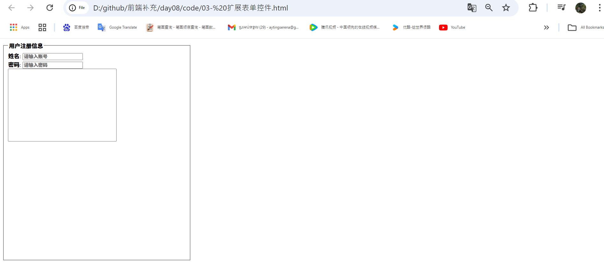

# 01- 扩展大招

>默认被选中：checked='checked' 可以简写为 checked

```html
  <input type="checkbox" name="like" checked="checked"> 玩游戏 
```
运行


> selected 设置城市被选中，默认的选择的第一个城市

```html
  <option value="南京" selected>南京</option>                   
```
运行


# 02- 扩展提高用户体验效果label标签

```html
      <label for="one">搜索:</label> <input type="text" id="one" name="user">
```
运行


# 03- 扩展表单控件
> fieldset 和 legend 配合将多个表单控件根据需求来分组
> fieldset 分组 legend 定义组标题
> placeholder="请输入账号" 默认文字 当你输入文字的时候会消失

```html
  <form action="">
            <fieldset>
                <legend>用户注册信息</legend>
                姓名: <input type="text" name="user" placeholder="请输入账号"> <br>
                密码: <input type="password" name="user"  placeholder="请输入密码"> <br>
                <textarea cols="30" rows="10"></textarea>
            </fieldset>
        </form>
```

```css
    fieldset{
            width: 500px;
            height: 600px;
        }
    textarea{
            width: 300px;
            height: 200px;
            /* 禁止拖动文本区域 */
            resize: none;
        }
```
运行


# table
> 语法格式
  `<table></table>`
  `<tr></tr>--行`
  `<td></td>--列`
      - 宽度 width
      - 高度 height
      - 对齐方式 align
      - 边距 cellpadding 控制文字与单元格之间的距离
      - 间距 cellspacing 控制单元格与单元格之间的距离
      - 背景色 bgcolor = red

* 写一个一行一列的表格
```html
   <table width="600" height="300" border="1" align="center">
      <tr>
          <td>这个就是典型的一行格</td>
      </tr> 
    </table>
```
运行


* 就像扩展
```html
 <table width="600" height="300" border="1" align="center" cellpadding="10"  cellspacing="10"
     >
        <tr>
            <td>1</td>
            <td>2</td>
            <td>3</td>
        </tr>
        <tr>
            <td>内容</td>
            <td>内容</td>
            <td>内容</td>
        </tr>
        <tr>
            <td>内容</td>
            <td>内容</td>
            <td>内容</td>
        </tr>
        <tr>
            <td>内容</td>
            <td>内容</td>
            <td>内容</td>
        </tr>
        <tr>
            <td>内容</td>
            <td>内容</td>
            <td>内容</td>
        </tr>
     </table>
```
运行


# 05- 扩展细线表格
   > 我们的表格都是给默认值的 0
        border='0' cellpadding='0' cellspacing='0'
  * 公式：老师的原创只要做细线表格间距给1
  * 步骤：记住了项目里面直接用
      * 1，给间距一个数值1，其他的边框和边距都是 0
      * 2，给table表格一个背景色，那么这个表格的背景色就是我们线的颜色
      * 3，给所有的单元格一个白色的背景色

      ```html
        <table width="500" height="300" border="0" align="center" cellpadding="0" cellspacing="1" bgcolor="red">
        <tr align="center" bgcolor="skyblue">
            <td>语文</td>
            <td>书写</td>
            <td>英语</td>
        </tr>
        <tr align="center" bgcolor="skyblue">
            <td>43</td>
            <td>67</td>
            <td>78</td>
        </tr>
        <tr align="center" bgcolor="skyblue">
            <td>90</td>
            <td>80</td>
            <td>87</td>
        </tr>
        <tr align="center" bgcolor="skyblue">
            <td>76</td>
            <td>89</td>
            <td>87</td>
        </tr>
        <tr align="center" bgcolor="skyblue">
            <td>82</td>
            <td>94</td>
            <td>84</td>
        </tr>
    </table>
      ```
运行


# 06- 扩展大招css实现细线表格

```html
   <table align="center" width="800" height="500" border="0" cellpadding="0" cellspacing="0"  >
        <tr>
            <td>1.1</td>
            <td>1.2</td>
            <td>1.3</td>
            <td>1.4</td>
            <td>1.5</td>
        </tr>
        <tr>
            <td>2.1</td>
            <td>2.2</td>
            <td>2.3</td>
            <td>2.4</td>
            <td>2.5</td>
        </tr>
        <tr>
            <td>3.1</td>
            <td>3.2</td>
            <td>3.3</td>
            <td>3.4</td>
            <td>3.5</td>
        </tr>
        <tr>
            <td>4.1</td>
            <td>4.2</td>
            <td>4.3</td>
            <td>4.4</td>
            <td>4.5</td>
        </tr>
        <tr>
            <td>5.1</td>
            <td>5.2</td>
            <td>5.3</td>
            <td>5.4</td>
            <td>5.5</td>
        </tr>
    </table>
```
```css
   table,td{
            border: 1px solid skyblue;
            /* 大招css的细线表格，推荐大家使用这个--加薪 */
            border-collapse: collapse;
            
        }
```
运行


# 07- 合并单元格
> 合并行 rowspan
  合并列 colspan

```html
   <table align="center" width="800" height="500" border="0" cellpadding="0" cellspacing="0"  >
        <tr>
            <!-- colspan 删除了 1.2 所以有两个列 -->
            <td colspan="2">1.1</td>
            
            <td>1.3</td>
            <td>1.4</td>
            <td>1.5</td>
        </tr>
        <tr>
            <td>2.1</td>
            <td>2.2</td>
            <td>2.3</td>
            <td>2.4</td>
            <td>2.5</td>
        </tr>
        <tr>
            <td>3.1</td>
            <td>3.2</td>
            <td>3.3</td>
            <td>3.4</td>
            <td>3.5</td>
        </tr>
        <tr>
            <td>4.1</td>
            <td>4.2</td>
            <td>4.3</td>
            <td>4.4</td>
            <td>4.5</td>
        </tr>
        <tr>
            <!-- colspan 删除了 5.2，5.3,5.4,5.5 所以有5个列 -->
            <td colspan="5">5.1</td>
          
        </tr>
        <tr>
            <td>6.1</td>
            <td>6.2</td>
            <td>6.3</td>
            <td>6.4</td>
            <td>6.5</td>
        </tr>
        <tr>
            <!-- 因为rowspan要两个行所以就删了 8.1，如果不删就有另外一个行错的 -->
            <td rowspan="2">7.1</td>
            <td>7.2</td>
            <td>7.3</td>
            <td>7.4</td>
            <td>7.5</td>
        </tr>
        <tr>
            <td>8.2</td>
            <td>8.3</td>
            <td>8.4</td>
            <td>8.5</td>
        </tr>
        <tr>
            <td>9.1</td>
            <td>9.2</td>
            <td>9.3</td>
            <td>9.4</td>
            <td>9.5</td>
        </tr>
    </table>
```
```css
   table,td{
            border: 1px solid skyblue;
            /* 大招css的细线表格，推荐大家使用这个--加薪 */
            border-collapse: collapse;

        }
```
运行


* 因为rowspan要两个行所以就删了 8.1，如果不删就有另外一个行错的 


# 08- 扩展表格其他一些属性
> caption 表格的标题
  thead 表格的头部
  tbody 表格主体
  tfoot 表格的底部

* 不用这个<h3 align="center">课程表</h3>了用 caption 

```html
     <table width="500" height="300" border="0" align="center" cellpadding="0" cellspacing="1" bgcolor="red">
        <caption>课程表</caption>

        <thead>
            <tr align="center" bgcolor="skyblue">
                <th>语文</th>
                <th>书写</th>
                <th>英语</th>
            </tr>
        </thead>
        
        <tbody>
            <tr align="center" bgcolor="skyblue">
                <td>43</td>
                <td>67</td>
                <td>78</td>
            </tr>
            <tr align="center" bgcolor="skyblue">
                <td>90</td>
                <td>80</td>
                <td>87</td>
            </tr>
        </tbody>

        <tfoot>
            <tr align="center" bgcolor="skyblue">
                <td>93</td>
                <td>85</td>
                <td>81</td>
            </tr>
        </tfoot>    
    </table>

```
运行


# 09- 扩展H5新增的标签
> header 头部
​​​​  nav 导航
​​​​  section 区块 等价于我们前面学习的div
​​  aside 侧边栏 左侧
​​​​  article 内容 右侧
​​​​  footer 底部

```html
    <header>头部</header>
        <nav>导航头部</nav>

        <section>
            <aside>左侧</aside>
            <article>内容</article>
        </section>

    <footer>底部</footer>
```
```css
     *{
            margin: 0;
            padding: 0;
        }

        header,nav,section,footer{
            width: 960px;
            border: 1px solid darkcyan;
            margin: 10px auto;
        }
        header{
            height: 80px;
        }
        nav{
            height: 30px;
        }
        section{
            height: 800px;
            padding: 5px;
            width: 950px;
        }
        aside{
            width: 200px;
            float: left;
            height: 800px;
            border: 1px solid brown;
        }
        article{
            width: 740px;
            float: right;
            height: 800px;
            border: 1px solid brown;
        }
```
运行


# 10- 半透明

>  取值范围是从 0 到 1 ，最小值是0， 最大值是1 记得没有单位 
           >* opacity: 0.1;

```html
     <div class="box"></div>
```
```css
    body{
            background: url("img/1.png") no-repeat;
        }
        .box{
            width: 300px;
            height: 300px;
            margin: 20px auto;
            background-color: #000;
            /* 取值范围是从 0 到 1 ，最小值是0， 最大值是1 记得没有单位 */
            opacity: 0.1;
        }
```
运行


* 加薪- 用一行代码实现半透明效果 

```css
    background: rgb(0,0,0,0.5); /* 取值范围 0-1 cs3提供的大招*/
```
运行


#### border-radius

```css
     background: rgb(0,0,0,0.5); /* 取值范围 0-1 cs3提供的大招*/
     border-radius: 150px; /* 盒子的宽度和高度一半*/
```
运行


* 推荐加薪写法，推荐使用百分比 
           
    ` border-radius: 50%;`
运行
