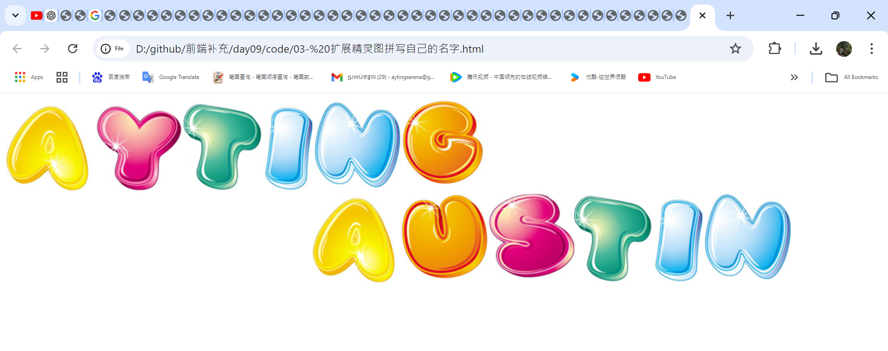
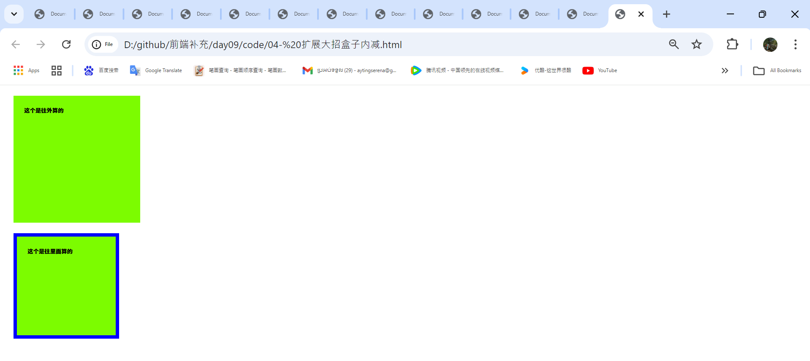
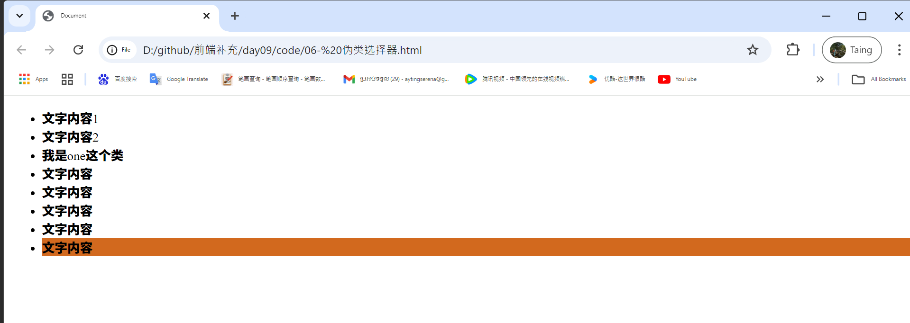

# 精灵图
> 为什么使用精灵图（目的）：
>- 为了有效的减少服务器接受和发送请求的次数，提高页面的加载速度，出现了 css 精灵技术（也称 css sprites，css 雪碧0.

> 核心原理：
>- 将网页中的一些小背景图像整合到一张大图中，这样服务器只需要一次请求就可以了。

> 重点： 
>- 如何使用精灵图，这个设计精灵图效果是UI妹子来设计好，我们要还会使用这个技术---加薪

- ctrl + 加号放大图片
- ctrl + 减号缩小图片

- ctrl + alt + 0 100%显示
- 按住 空格 可以移动图片

> 总结：公式-------除了左上角是 0 0 坐标，其他的都是负值，打遍天下无敌手，都是可以通过测试来检测的


* 从UI妹子来做


`<div class="box"></div> `
```css
    .box{
            width: 86px;
            height: 34px;
            margin: 100px;
            /* background-color: palegoldenrod; */
            /* -350 -110represent the horizontal (x) and vertical (y)  */
            /* this code positions the image with specific offsets and prevents it from repeating across the background.   */
            background: url("img/01.png") no-repeat -350px -110px;

        }
```
运行


`<div class="box2"></div> `
```css
  .box{
            width: 86px;
            height: 34px;
            margin: 100px;
            background: url("img/01.png") no-repeat -350px -110px;

        }
  .box2{
            width: 36px;
            height: 21px;
            margin: 200px;
            background: url(img/01.png) no-repeat -600px -160px;
        }
```
运行


# 02- 淘宝精灵图效果
` <div class="logo"></div`
```css
     .logo{
            width: 142px;
            height: 60px;
            background: url("img/02.png") no-repeat 0 0 ;
        }
```
运行


-  加 `margin: 100px;  `

` <div class="logo"></div`
```css
     .logo{
            width: 142px;
            height: 60px;
            background: url("img/02.png") no-repeat 0 0 ;
            margin: 100px;  
        }
```
运行


```html
    <div class="logo"></div>
    <div class="cat"></div>
```
```css
    .logo{
            width: 142px;
            height: 60px;
            background: url("img/02.png") no-repeat 0 0 ;
            margin: 100px;    
        }
        .cat{
            width: 31px;
            height: 11px;
            background: url("img/02.png") no-repeat -100px -165px;
            margin: 100px;
        }
```
运行

# 03- 扩展精灵图拼写自己的名字


宝子们这个案例非常经典的，你们写自己的名字，最少五个字母 这个经典之处，下次一提醒到拼名字就相到了精灵图 

```html
     <div>
        <div class="a"></div>
        <div class="y"></div>
        <div class="t"></div>
        <div class="i"></div>
        <div class="n"></div>
        <div class="g"></div>
    </div> <br>

    <div class="d2">
        <div class="a"></div>
        <div class="u"></div>
        <div class="s"></div>
        <div class="t"></div>
        <div class="i"></div>
        <div class="n"></div>
    </div>
```

```css
    .a,.y,.t,.i,.n,.g{
            float: left;
            background: url("img/03.jpg") no-repeat ;
        }
        .a{
            width: 115px;
            height: 124px;
            
        }
        .y{
            width: 115px;
            height: 121px;
            background-position:  -364px -548px  ;
        }
        .t{
            width: 102px;
            height: 123px;
            background-position:  -368px -410px ;
        }
        .i{
            width: 64px;
            height: 123px;
            background-position: -324px -131px;
        }
        .n{
            width: 116px;
            height: 115px;
            background-position:-253px -272px ;
        }
        .g{
            width: 111px;
            height: 119px;
            background-position:  -97px -139px ;
        }
        .d2{
            float: left;
        }
        .a,.u,.s,.t,.i,.n{
          float:left;
         background: url("img/03.jpg") no-repeat ;
        }
        .a{
            width: 115px;
            height: 124px;
            
        }
        .u{
            width: 113px;
            height: 116px;
            background-position: -475px -417px  ;
        }
        .s{
            width: 111px;
            height: 115px;
            background-position:  -256px -417px  ;
        }
        .t{
            width: 102px;
            height: 123px;
            background-position:  -368px -410px ;
        }
        .i{
            width: 64px;
            height: 123px;
            background-position: -324px -131px;
        }
        .n{
            width: 116px;
            height: 115px;
            background-position:-253px -272px ;
        }
```
运行


# 04- 扩展大招盒子内减
example1
```html
    <div class="box1">这个是往外算的</div>
    <div class="box2">这个是往里面算的</div>
```
```css
     div{
            width: 300px;
            height: 300px;
            background-color: lawngreen;
            margin: 30px;
        }
        
```
运行


Example 2 
```html
    <div class="box1">这个是往外算的</div>
    <div class="box2">这个是往里面算的</div>
```
```css
div{
            width: 300px;
            height: 300px;
            background-color: lawngreen;
            margin: 30px;
        }
        .box1{
            /* 给了盒子内减就会把盒子变大了，这个我们早就会了 */
            padding: 30px;
        }
        .box2{
            padding: 30px;
            /* 这个不是普通的外加，而是自动内减，这个盒子还是原来的大小，不管是加边框还是加内边距都不会变大 */
            box-sizing: border-box;
            border: 10px solid blue;
        }
```
运行


# 05- 关系选择器
```html
<ul>
        <li>文字内容</li>
        <li>文字内容</li>
        <li>
            <p>我是子代标签</p>
            <div>
                <p>我会后代标签</p>
            </div>
        </li>
        <li>文字内容</li>
        <li>文字内容</li>
        <li class="one">我是one这个类</li>
        <li>文字内容</li>
        <li>文字内容</li>
        <li>文字内容</li>
    </ul>
```
- 后代选择器，不管是儿子还是孙子都会选择的
```css
    li p{
            color: blueviolet; 
        }
```
运行


- 只选择子代，或者说儿子，不会选择后代
```css
     li > p{
            color: saddlebrown; 
        }
```
运行


- 从one向下选择第一个li
```css
 .one + li{
            color: navy;
         }
```
运行


- 从one向下选择所有的li
```css
    .one~li{
            color: slateblue;
        }
```
运行

# 06- 伪类选择器
- 选择一个li
```html
     <ul>
        <li>文字内容1</li>
        <li>文字内容2</li>
        <li class="one">我是one这个类</li>
        <li>文字内容</li>
        <li>文字内容</li>
        <li>文字内容</li>
        <li>文字内容</li>
        <li>文字内容</li>
    </ul>
```

```css
li:first-child{
            background-color: chocolate;
        }
```
运行


- 选择最后一个li

html 和上面一样

```css 
     li:last-child{
            background-color: chocolate;
        }
```
运行


- 选择只有一个li元素，就是那个独生子女
```html
 <ul>
        <li>文字内容1</li>
        <li>文字内容2</li>
        <li class="one">我是one这个类</li>
        <li>文字内容</li>
        <li>文字内容</li>
        <li>文字内容</li>
        <li>文字内容</li>
        <li>文字内容</li>
    </ul>
    <ul>
        <li>独生子女</li>
    </ul>

```
```css
    li:only-child{
            background-color: saddlebrown; 选择只有一个li元素，就是那个独生子女
        }
```
运行


- 选择第二个li

html 和上面一样

```css
      li:nth-child(2){
            background-color: chartreuse;
        }
```
运行


- 这个高度是给显示用的，因为里面没有内容看不到效果，高度来占位

```html
<ul>
        <li>文字内容1</li>
        <li>文字内容2</li>
        <li class="one">我是one这个类</li>
        <li>文字内容</li>
        <li>文字内容</li>
        <li>文字内容</li>
        <li>文字内容</li>
        <li>文字内容</li>
    </ul>
    <ul>
        <li>独生子女</li>
    </ul>
    <ul></ul>
```
```css
     ul:empty{
            background-color: red;
            height: 20px;       
        }
```
运行


- 除了这个 one之外都选择，取反，选择除了这个one之外的都选择
```html
    <ul>
        <li>文字内容1</li>
        <li>文字内容2</li>
        <li class="one">我是one这个类</li>
        <li>文字内容</li>
        <li>文字内容</li>
        <li>文字内容</li>
        <li>文字内容</li>
        <li>文字内容</li>
    </ul>
    <ul>
        <li>独生子女</li>
    </ul>
```
```css
    li:not(.one){
            background-color: royalblue;
        }
```
运行


- 在内容之前:后面我们还会用到这个技术,后面扩展

```html
    <ul>
        <li>文字内容1</li>
        <li>文字内容2</li>
        <li class="one">我是one这个类</li>
        <li>文字内容</li>
        <li>文字内容</li>
        <li>文字内容</li>
        <li>文字内容</li>
        <li>文字内容</li>
    </ul>
    <ul>
        <li>独生子女</li>
    </ul>
    <ul></ul>
    <div>是</div>
```
```css   
        div:before{
            /* 在内容之前:后面我们还会用到这个技术,后面扩展*/
            content: '今天';
        }
```
运行


- 在内容之后:后面我们还会用到这个技术,后面扩展

```html
    <ul>
        <li>文字内容1</li>
        <li>文字内容2</li>
        <li class="one">我是one这个类</li>
        <li>文字内容</li>
        <li>文字内容</li>
        <li>文字内容</li>
        <li>文字内容</li>
        <li>文字内容</li>
    </ul>
    <ul>
        <li>独生子女</li>
    </ul>
    <ul></ul>
    <div>是</div>
```
```css   
        div:before{
            /* 在内容之前:后面我们还会用到这个技术,后面扩展*/
            content: '今天';
        }
        div:after{
            /* 在内容之后:后面我们还会用到这个技术,后面扩展*/
            content: '周五';
        }
```
运行


# 07- 属性选择器

1. 只选择定义了aihao属性，以c开头的元素
```html
    <ul>
        <li>文字内容</li>
        <li>文字内容</li>
        <li aihao="cf" > 出去玩</li>>文字内容</li>
        <li aihao="dalan" >打篮球</li>>文字内容</li>
        <li aihao="dayou" > 打游戏</li>>文字内容</li>
        <li>文字内容</li>
        <li>文字内容</li>
        <li>文字内容</li>
        <li>文字内容</li>
        <li>文字内容</li>
        <li>文字内容</li>
        <li>文字内容</li>
    </ul>
```
```css
     li[aihao^=c]{
            color: blue; 
        }
```
运行


2. 只选择定义了aihao属性，以n结尾的元素

```html
    <ul>
        <li>文字内容</li>
        <li>文字内容</li>
        <li aihao="cf" > 出去玩</li>>文字内容</li>
        <li aihao="dalan" >打篮球</li>>文字内容</li>
        <li aihao="dayou" > 打游戏</li>>文字内容</li>
        <li>文字内容</li>
        <li>文字内容</li>
        <li>文字内容</li>
        <li>文字内容</li>
        <li>文字内容</li>
        <li>文字内容</li>
        <li>文字内容</li>
    </ul>
```
```css
    li[aihao$=n]{
            color: blue; 
        }
```
运行


3. 只选择定义了aihao属性，带有a的所有元素

```html
    <ul>
        <li>文字内容</li>
        <li>文字内容</li>
        <li aihao="cf" > 出去玩</li>>文字内容</li>
        <li aihao="dalan" >打篮球</li>>文字内容</li>
        <li aihao="dayou" > 打游戏</li>>文字内容</li>
        <li>文字内容</li>
        <li>文字内容</li>
        <li>文字内容</li>
        <li>文字内容</li>
        <li>文字内容</li>
        <li>文字内容</li>
        <li>文字内容</li>
    </ul>
```
```css
     li[aihao*=a]{
            color: blue;       
        }
```
运行


4. 
```html
    <ul>
        <li>文字内容</li>
        <li>文字内容</li>
        <li aihao="cf" > 出去玩</li>>文字内容</li>
        <li aihao="dalan" >打篮球</li>>文字内容</li>
        <li aihao="dayou" > 打游戏</li>>文字内容</li>
        <li>文字内容</li>
        <li>文字内容</li>
        <li>文字内容</li>
        <li>文字内容</li>
        <li>文字内容</li>
        <li>文字内容</li>
        <li>文字内容</li>
    </ul>
```
```css
      li[aihao]{
            color: blue;}
```
运行


# 08- 扩展三角写法
1. 
` <div></div>` 
```css
     div{     
            width: 0;
            height: 0;
            border-top: 10px solid navy;
            border-right: 10px solid aquamarine;
            border-bottom: 10px solid purple;
            border-left: 10px solid green;
        }
```
运行


2. 
` <div></div>` 
```css
     div{     
            width: 100px;
            height: 100px;
            border-top: 10px solid navy;
            border-right: 10px solid aquamarine;
            border-bottom: 10px solid purple;
            border-left: 10px solid green;
        }
```


3. 
` <div></div>` 
```css
    div{
            width: 0;
            height: 0;
            border-width: 10px ; /* 边框的宽度*/
            border-style: solid dashed dashed dashed; /*边框样式*/
            border-color: olivedrab transparent transparent transparent; /*边框的颜色*/
            /* 
                transparent 透明的意思
                严格按照老师讲解的顺序来写-----规范
            */
        }
```
运行


# 09- 扩展下拉菜单效果

1. 
`<div></div>`
```css      
     div{
        width: 300px;
        height: 30px;
        border: 1px solid rebeccapurple;
        margin: 100px auto;  
    }
```
运行


> 要求: 一个盒子实现两个盒子的效果，这个技术一般用在移动最多
2. 
`<div></div>`
```css
    div{
            width: 300px;
            height: 30px;
            border: 1px solid rebeccapurple;
            margin: 100px auto;
            /* 父相子绝---相对定位 */
            position: relative;
        }
        div:before{
            content: "";
            width: 10px;
            height: 10px;
            border-top: 1px solid seagreen;
            border-right: 1px solid seagreen;
            position: absolute;
            right: 10px;
            top: 10px;    
            /*  后面会给大家扩展这2D 旋转，先体检一下感受它的魅力 */
            transform: rotate(45deg);
        }
```
运行


# 10- 扩展新增表单属性

- placeholder="请输入内容" 表单的默认值，当  你输入 文字的时候他会消失，当你删除文字的时候他会显示
- required="required" 简单表单input 不能为空，当你为空的时候给你一个提示
- autofocus='autofocus' 自动获取焦点，当你打开页面的时候自动获取焦点，站在用户的焦点去考虑问题了--可以加薪了
- type="email" 要求必须填写邮箱格式
- type="date" 自动提示日期
- type="number" 必须输入数字
- type="color"  自动提示颜色
- type="range"  自动带滚动条

```html
    <form action="">

            搜索内容：<input type="text" placeholder="请输入内容" required="required" autofocus="autofocus">

            请输入邮箱：<input type="email" > <br>
            请输入日期：<input type="date"><br>
            请输入电话号码：<input type="number"> <br>
            请选择颜色: <input type="color"> <br>
            滚动条效果: <input type="range"> <br>

            <input type="submit" value="提交">

        </form>
```
运行
<video controls src="img/32.mp4" title="Title"></video>